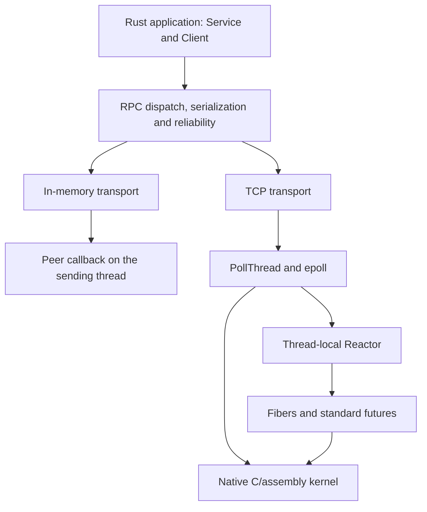

# The sRPC book

sRPC is an RPC library written in Rust. This book starts with a working Rust
service and client, then explains the runtime, protocol and public APIs used by
native Cargo applications. The Rust library uses Rust std and a small C/assembly
kernel.

The [C++ companion](srpc-cpp-book.md) covers translation, CMake builds, service
code generation and C++ application APIs. Those tools are a separate way to use
the canonical Rust implementation.

## Contents

1. [Getting started](#1-getting-started)
2. [Architecture](#2-architecture)
3. [Fibers](#3-fibers)
4. [The reactor pattern](#4-the-reactor-pattern)
5. [Event system](#5-event-system)
6. [I/O layer: polling and connections](#6-io-layer-polling-and-connections)
7. [RPC protocol](#7-rpc-protocol)
8. [RPC client](#8-rpc-client)
9. [RPC server](#9-rpc-server)
10. [Serialization](#10-serialization)
11. [Reliability features](#11-reliability-features)
12. [Threading and synchronization](#12-threading-and-synchronization)
13. [Performance tuning](#13-performance-tuning)
14. [Pitfalls and best practices](#14-pitfalls-and-best-practices)
15. [Troubleshooting](#15-troubleshooting)
16. [Rust API and verification](#16-rust-api-and-verification)

---

## 1. Getting started

sRPC is a Rust RPC library. Applications implement services, serialize requests and
use clients through the `srpc` crate. The runtime provides TCP and in-memory
transports, an epoll poller, stackful fibers, standard Rust futures, and request
reliability policies.

The library uses Rust std plus a small C/assembly kernel for native operations and
fiber context switching. Cargo builds it without the C++ runtime, transpiler or
submodules. The [C++ companion](srpc-cpp-book.md) describes a separate consumer of
the same Rust implementation, including its service generator and typed proxies.

### Scope and requirements

sRPC supports Linux on x86_64 and aarch64. Install a stable Rust toolchain, a C
compiler and an archiver. `build.rs` uses `CC` and `AR` when set, otherwise `cc` and
`ar`, and selects the fiber assembly for the target architecture. The native build
currently assumes those tools produce code for the Cargo target.

The root Cargo package has no production Rust dependencies. Its property tests use
`proptest` as a development dependency. The library is consumed from a checkout;
`Cargo.toml` currently sets `publish = false`.

### Building and testing sRPC

```sh
git clone https://github.com/stonysystems/srpc
cd srpc
cargo test --locked --workspace --all-targets
cargo test --locked --workspace --doc
cargo clippy --locked --workspace --all-targets -- -D warnings
cargo doc --locked --no-deps --open
```

These commands need no submodule initialization. For an application beside the
checkout, create a Cargo project and add a path dependency:

```sh
cargo new ../hello-srpc
```

In `hello-srpc/Cargo.toml`:

```toml
[dependencies]
srpc = { path = "../srpc" }
```

`bench/` and `verify/` are separate Cargo workspaces. The regular test command does
not run benchmarks or Verus; the performance and verification sections give their
commands. Tests and documentation checks run locally; this repository has no CI.

### The shape of a service

A Rust service implements `srpc::server::Service`. Registration associates an RPC id
with a dispatch mode. Dispatch reads the arguments and supplies a writer for the
reply. Choose ids as part of your protocol and keep client and server definitions in
agreement.

The following complete `src/main.rs` performs an RPC without opening a network
port. Both endpoints use factories backed by one in-memory switchboard. It exercises
the real client, service dispatch and serialization code.

```rust
use std::ffi::CString;
use std::sync::Arc;

use srpc::client::{deserialize_from, Client, FutureAttr};
use srpc::inmemory_channel::{make_inmemory_factory_proxy, InMemoryFactory, InMemorySwitchboard};
use srpc::reactor::PollThread;
use srpc::serializable::{BinaryReadArchive, BinaryWriteArchive, Deserialize, Serialize};
use srpc::server::{Request, Server, ServerReplyFn, Service, WeakServerConnection};

const DOUBLE: i32 = 0x00E0_0042;

struct DoubleService;

impl Service for DoubleService {
    fn __reg_to__(&mut self, server: &mut Server, service_index: usize) -> i32 {
        server.reg_fast_rpc(DOUBLE, service_index)
    }

    fn __dispatch__(&self, rpc_id: i32, mut req: Box<Request>, connection: WeakServerConnection) {
        assert_eq!(rpc_id, DOUBLE);
        let mut value = 0_i64;
        let malformed = {
            // SAFETY: the boxed request owns this source for the entire read.
            let mut reader = BinaryReadArchive::new(unsafe {
                srpc::serializable::make_source_proxy_buffer(&raw mut req.src)
            });
            Deserialize::deserialize(&mut value, &mut reader);
            reader.failed()
        };
        if malformed {
            srpc::server::reject_malformed_request(&req, &connection);
            return;
        }

        if let Some(connection) = connection.upgrade() {
            let writer: ServerReplyFn = Some(Box::new(move |out: &mut BinaryWriteArchive| {
                Serialize::serialize(&(value * 2), out);
            }));
            connection.reply(&req, 0, writer);
        }
    }
}

fn main() {
    let switchboard = Arc::new(InMemorySwitchboard::new());
    let address = CString::new("inmemory://double").unwrap();
    let server_poll = PollThread::create();
    let client_poll = PollThread::create();

    let mut server = Server::new(Some(server_poll.clone()));
    server.set_channel_factory(Some(make_inmemory_factory_proxy(Arc::new(
        InMemoryFactory::new(switchboard.clone()),
    ))));
    server.reg_service(Box::new(DoubleService));
    // SAFETY: address is NUL-terminated and remains alive for the call.
    assert_eq!(unsafe { server.start(address.as_ptr()) }, 0);

    let client = Client::create(client_poll.clone());
    client.set_channel_factory(Some(make_inmemory_factory_proxy(Arc::new(
        InMemoryFactory::new(switchboard),
    ))));
    assert_eq!(client.connect(address.as_ptr(), true), 0);

    let reply = client.request(DOUBLE, &FutureAttr::default(), |out| {
        Serialize::serialize(&21_i64, out);
    }).expect("request accepted");
    reply.wait();
    assert_eq!(reply.get_error_code(), 0);
    let mut doubled = 0_i64;
    deserialize_from(reply.get_reply(), &mut doubled);
    assert_eq!(doubled, 42);
    println!("double(21) = {doubled}");

    client.close();
    drop(client);
    server.graceful_shutdown(1_000);
    drop(server);
    client_poll.shutdown();
    server_poll.shutdown();
}
```

Run it with `cargo run --manifest-path ../hello-srpc/Cargo.toml` from the sRPC
checkout. The expected output includes `double(21) = 42`. The maintained
[in-memory round-trip tests](../tests/rpc_roundtrip_inmemory_rust.rs) cover the same
path and an unknown RPC id.

`reg_fast_rpc` dispatches inline on the delivering thread. A handler on that path
must finish without blocking. `reg_rpc` gives the handler a stackful fiber. The
server chapter explains dispatch choices and deferred replies.

The callback is `Some(Box::new(...))` because `ServerReplyFn` is an optional owned
writer. The service has a shared `&self` dispatch receiver and must satisfy
`Send + Sync`. Synchronize mutable application state instead of treating dispatch
as an exclusive borrow of the service.

The in-memory transport delivers inline and does not reproduce TCP stream framing
or asynchronous network timing. Use the TCP and runtime tests as well when changing
transport behavior.

### Navigating the Rust API

Import types from their modules, for example `srpc::client::Client`,
`srpc::server::Service` and `srpc::reactor::PollThread`. `src/lib.rs` declares those
modules; it does not re-export every type at the crate root.

Use ordinary Rust ownership and error handling: `Arc`, `Rc`, `Box`, `Option`,
`Result`, closures and standard futures. An `Arc<T>` does not make `T` thread-safe.
In particular, each application thread owns its own `Client`; reactor events and
fibers also stay on their creating thread.

There are three different future mechanisms:

| Type | What drives it |
| --- | --- |
| `srpc::client::Future` | RPC reply delivery; its blocking waits use an OS condition variable |
| `srpc::future::FiberFuture<T>` | A promise resolved while a stackful fiber yields to its reactor |
| `std::future::Future` | Polling by the reactor's stackless task support |

Calling `.wait()` on an RPC future blocks the calling OS thread. It is not an
`.await` operation and cannot make progress if that same thread must deliver the
reply. The client and reactor chapters explain these differences in detail.

---

## 2. Architecture

### The crate and its modules

The production library is one Cargo crate. Its Rust modules live in `base/`,
`misc/`, `reactor/` and `rpc/`; `src/lib.rs` includes them with `#[path]` declarations.
The source layout groups responsibilities without creating separate Rust crates.

| Area | Main responsibilities |
| --- | --- |
| `base/` | Numeric and timing helpers, logging, diagnostics and synchronization helpers |
| `misc/` | Serialization, payload containers, statistics and randomness |
| `reactor/` | Epoll polling, stackful fibers, events, fiber futures and standard-future scheduling |
| `rpc/` | Services, clients, transports, wire framing, request policies and connection state |

`Client`, `ClientConnection`, `ClientPool` and the RPC `Future` are all in
`rpc/client.rs`, exposed as `srpc::client`. `Reactor`, `Fiber`, `PollThread` and the
event types are in `reactor/reactor.rs`, exposed as `srpc::reactor`. The separate
`srpc::future` module contains fiber promises and futures.

The reactor uses the transport-facing `PollableBase` contract from
`rpc/pollable_proxy.rs`. Directory names therefore do not define a strict dependency
hierarchy. Read module imports and trait bounds when changing ownership across a
boundary.

### Runtime ownership



A `PollThread` owns a worker thread that services commands and I/O. Each worker has
its own thread-local reactor. Commands cross that boundary through synchronized
queues; the reactor's fibers and events do not move to the submitting thread.

A server freezes service registration before dispatch. Its shared service context
owns boxed `Service` implementations, whose `Send + Sync` bounds and shared dispatch
receiver let the implementation synchronize application state explicitly. With TCP,
one server currently uses one dispatch poll thread. The `Server` configuration and lifecycle
handle is not itself a freely shared Rust value.

Clients retain shared connections and RPC futures, but the `Client` handle contains
thread-confined configuration and a connection slot. Connection state, future
completion and reliability managers use their own synchronization. Keep the
properties of these types separate when designing a multithreaded application.

### The path of one request

1. The application calls `Client::request`, `request_with_options` or
   `request_async`, supplying a method id and an argument writer.
2. The client connection checks admission and request policy, assigns a transaction
   id, and serializes `v64 xid | i32 rpc_id | arguments`.
3. TCP adds the frame header and sends the bytes. The receiving TCP channel handles
   partial reads and reconstructs complete frames. In-memory delivery uses a shared
   switchboard directly.
4. The server selects the registered service and dispatch mode. Its `Service`
   implementation decodes arguments and replies through a live connection.
5. The reply carries `v64 xid | v32 error | v64 server_instance_id | payload`.
   Client delivery finds the matching callback or future and completes it.

Request completion, timeout, close and retry can race. The client chapter describes
which object owns each stage and how replay relates to the caller's wait budget.
The wire protocol chapter describes the framing and native-endian encoding limits.

### The native kernel

Cargo compiles the nine C sources listed in
[native-kernel-sources.txt](../scripts/native-kernel-sources.txt), plus the selected
architecture's fiber assembly, and links them as `libsrpc_native.a`. They provide
native OS/resource operations, clock and entropy access, platform layouts, stack
allocation and context switching.

Scheduling decisions, events, serialization, framing and RPC policies remain Rust
code. A native binding is not a second implementation of those policies. The
[ownership notes](canonical-rust-runtime.md) and [native binding inventory](../scripts/native-abi-bindings.json)
record the boundary in more detail.

Unsafe contracts are concentrated at raw archive pointers, native handles, FFI and
context switching. Standard Rust ownership still applies on either side of a safe
wrapper; each unsafe operation needs its documented lifetime and ownership
preconditions to hold.

### Finding code and tests

| Path | What to read there |
| --- | --- |
| `src/lib.rs` | Public module index, generated from `rust-modules.toml` |
| `base/`, `misc/`, `reactor/`, `rpc/` | Canonical library implementation |
| `build.rs` | Cargo's native C/assembly build |
| `tests/*_rust.rs` | Rust integration and property tests |
| `bench/` | Separate Cargo microbenchmark package |
| `verify/` | Separate Verus verification package |
| `scripts/` | Source/native audits, benchmark commands and verification entry points |

Changes to `src/lib.rs` come from `scripts/extract_srpc_rust.py`; edit the module
manifest and canonical sources instead of adding an alternative implementation
under `src/`.

The repository also contains C++ headers, generation metadata and CMake targets for
the optional translated library. They are explained in the
[C++ companion](srpc-cpp-book.md). Cargo does not load them. Contributors changing
canonical code must validate both consumers as described in [CLAUDE.md](../CLAUDE.md).

---

---

## 3. Fibers

A fiber lets a handler suspend in the middle of an ordinary function and resume
with its local variables intact. sRPC uses stackful fibers for handlers that need
to wait for another RPC. Each fiber has its own stack, but fibers on one reactor
share one operating-system thread and run cooperatively.

`srpc::reactor::{Fiber, Reactor}` contains the scheduler and fiber handles.
`srpc::fiber::this_fiber` provides operations on the currently running fiber.
The same reactor also polls standard Rust futures, described later in this chapter.

### Why fibers instead of threads

A suspended fiber leaves its worker free to handle other requests. Creating one
operating-system thread for every waiting request would instead leave scheduling
and a much larger population of threads to the kernel. sRPC fibers reserve a
1 MiB stack plus a guard page by default. The mapped stack does not imply that
all of those pages are resident.

| Property | Operating-system thread | sRPC fiber |
|----------|-------------------------|------------|
| Scheduling | The kernel can preempt it | Runs until it yields, waits, or returns |
| Parallel execution | Can run on another CPU | Shares its reactor's thread |
| Waiting | A blocking call blocks this thread | An sRPC fiber wait suspends this fiber |
| State shared with peers | Usually needs synchronization | Can use `Cell` and `RefCell` on the same thread |
| Stack | Allocated by the thread runtime | Native fiber stack, 1 MiB by default |

A blocking socket call, `std::thread::sleep`, or a long computation still blocks
the entire reactor thread. Use the fiber sleep helpers for a delay inside a
fiber. Move blocking work to a separate thread, and arrange an owner-thread
notification when it finishes.

### Sharing state within one reactor

Use `Rc<Cell<T>>` for small copyable values and `Rc<RefCell<T>>` for compound
state shared by local fibers. Release every `RefCell` borrow before a suspension
point. Another fiber may access that state before the first one resumes.

This complete example runs two fibers on the calling thread. Both finish before
`create_run` returns, so the result is immediately available.

```rust
use srpc::reactor::Fiber;
use std::cell::Cell;
use std::rc::Rc;

fn main() {
    let count = Rc::new(Cell::new(0));
    for _ in 0..2 {
        let count = count.clone();
        Fiber::create_run(move || count.set(count.get() + 1));
    }
    assert_eq!(count.get(), 2);
}
```

Cooperative scheduling does not relax Rust's aliasing rules. Do not keep an
exclusive borrow of shared state across a call that can suspend, including an
RPC wait. A retained `RefMut` will make a competing borrow panic; constructing
another mutable reference with a raw pointer can instead cause undefined behavior.

### The fiber API

`Fiber::create_run` takes an `FnMut() + 'static` closure and returns `Rc<Fiber>`.
Move owned values or cloned handles into the closure. The `'static` bound prevents
it from borrowing a local variable that may disappear while the fiber is paused.

| Operation | Behavior |
|-----------|----------|
| `Fiber::create_run(body)` | Run the body immediately until its first suspension or completion |
| `Fiber::current_fiber()` | Return `Option<Rc<Fiber>>` for this thread's running fiber |
| `fiber.finished()` | Report whether the body has finished or its fiber has been recycled |
| `reactor.continue_fiber(&fiber)` | Resume a paused fiber on its owning reactor |
| `this_fiber::current()` | Return the current fiber, or `None` |
| `this_fiber::get_id()` | Return its local ID, or zero outside a fiber |
| `this_fiber::in_fiber_context()` | Distinguish running inside a fiber from ordinary thread code |
| `this_fiber::r#yield()` | Suspend until the owner explicitly resumes the fiber; a no-op outside a fiber |
| `this_fiber::sleep_us(us)` | Suspend for a relative delay in microseconds |
| `this_fiber::sleep_ms(ms)` / `sleep_s(seconds)` | Convert to microseconds and sleep |
| `this_fiber::sleep_until_us(deadline)` | Sleep until an absolute `Time::now(true)` deadline |

`yield` is a Rust keyword, so the function uses the raw identifier `r#yield`.
Fiber IDs begin at zero on each thread. The first fiber's ID can therefore equal
the value returned outside fiber context. Test `in_fiber_context()` or `current()`
when that distinction matters. IDs are not a process-wide identity, and a reused
fiber receives a fresh ID.

A positive sleep requires fiber context. Zero-duration sleeps and deadlines that
have already passed return immediately. The millisecond and second helpers use
wrapping multiplication, so keep their arguments within the microsecond range.
`Fiber::sleep(us)` is another entry point for the relative microsecond sleep.

### `create_run` runs the body immediately

A plain yield does not put a fiber on an automatic runnable queue. Keep the
returned handle and resume it when your own scheduling condition is satisfied.
The reactor's `run_loop` wakes event waiters and ready futures; it does not resume
an arbitrary fiber that only called `r#yield()`.

```rust
use srpc::fiber::this_fiber;
use srpc::reactor::{Fiber, Reactor};
use std::cell::RefCell;
use std::rc::Rc;

fn main() {
    let reactor = Reactor::get_reactor();
    let trace = Rc::new(RefCell::new(Vec::new()));
    let inside = trace.clone();
    let fiber = Fiber::create_run(move || {
        inside.borrow_mut().push(1);
        this_fiber::r#yield();
        inside.borrow_mut().push(3);
    });
    assert_eq!(&*trace.borrow(), &[1]);
    trace.borrow_mut().push(2);
    reactor.continue_fiber(&fiber);
    assert!(fiber.finished());
    assert_eq!(&*trace.borrow(), &[1, 2, 3]);
}
```

Each temporary borrow in this example ends at its semicolon, before the yield.
For production code, an event wait usually expresses the condition more clearly
than a bare yield and a separately stored fiber handle.

### Lifecycle

The public `FiberStatus` values describe the scheduler's state transitions.

| State | Meaning |
|-------|---------|
| `INIT` | Allocated, not yet entered |
| `STARTED` | Running for the first time |
| `PAUSED` | Suspended on the fiber stack |
| `RESUMED` | Running after a continuation |
| `FINISHED` | The submitted body returned |
| `RECYCLED` | Finished storage has entered the reactor's reuse pool |
| `FINALIZING` | Retained state value; it is not a stack-unwinding cancellation mechanism |

The reactor owns its active fiber registry and restores the previously running
fiber after a nested `create_run` or continuation. When reuse is enabled, a
finished fiber can supply a stack for another body. Do not use a retained handle
to a completed fiber as a durable task identity or resume it after completion.

### Abandoning a paused fiber

Dropping the handle returned by `create_run` does not cancel the task. The
reactor also owns the fiber, so a registered event can still wake it.

Destroying the reactor with suspended fibers is more serious. The native engine
unmaps those stacks; it does not unwind the Rust frames on them. Local guards and
other values on an abandoned stack do not get their normal `Drop` calls. `FINALIZING`
and the old finalization flag do not change that behavior. Finish outstanding work
or arrange for waiting fibers to resume and return before tearing down the owner.

### Where fibers come from in the RPC path

A service registers an ordinary handler with `Server::reg_rpc`. Dispatch then
starts a fiber for that request, so the handler can make a nested RPC and wait
cooperatively. A handler registered with `reg_fast_rpc` runs inline in the
transport's frame callback. With TCP, that callback runs on the poll thread.
A fast handler must return promptly or start work that can complete later.

### Implementation: the C engine and the assembly

Canonical Rust owns scheduling, closures, event state, and task lifetimes. The
small native engine in `reactor/srpc_fiber.{h,c}` owns the stack mapping and saved
registers. Rust supplies an entry callback that the engine invokes on the fiber
stack. `fiber_context_x86_64.S` and `fiber_context_aarch64.S` perform the register
switch for the supported Linux targets.

The register layout is an ABI between the C header and the assembly. The x86_64
context has eight machine words: `rsp`, `rip`, `rbx`, `rbp`, and `r12` through
`r15`, at offsets 0 through 56. The aarch64 context has thirteen: `sp`, `pc`,
`x19` through `x28`, and `fp`, at offsets 0 through 96. Changing the C structure
requires changing the matching assembly offsets.

On x86_64 the switch saves a local resume label and returns through the saved
stack. On aarch64 it saves the caller's link register as the resume PC. Stack
allocation uses `mmap` and places an inaccessible guard page at the low end.
The initial stack is aligned to 16 bytes, with the x86_64 entry adjustment needed
for its calling convention. Allocation and guard-page setup failures abort.
The trampoline invokes the Rust entry callback and records completion before
switching back. The engine cannot unwind a suspended Rust stack.

Native task storage must stay at a stable address while a context refers to it.
Use the managed `Fiber::create_run` path; the low-level engine structs and entry
functions are implementation details. The native kernel also provides thread-ID
and fiber-reuse configuration queries. Ordinary Rust collections and ownership
remain in the Rust library.

### Standard futures and stackless tasks

The reactor can drive a normal Rust `Future`, including an `async` block that
captures `Rc` state. It does not require the task or its output to be `Send`.
`reactor_spawn_stackless_task_with_result` accepts a
`Pin<Box<dyn Future<Output = T>>>` and an `FnMut(T) + 'static` completion callback.
`Box::pin` creates the pinned task; `T` only needs to be `'static`.

This complete example deliberately returns `Pending` once and wakes itself.
It is adapted from `tests/stackless_wake_pump_rust.rs`.

```rust
use srpc::reactor::{reactor_spawn_stackless_task_with_result, Reactor};
use std::cell::Cell;
use std::future::Future;
use std::pin::Pin;
use std::rc::Rc;
use std::task::{Context, Poll};

struct PendingOnce(bool);

impl Future for PendingOnce {
    type Output = i64;

    fn poll(mut self: Pin<&mut Self>, cx: &mut Context<'_>) -> Poll<i64> {
        if self.0 {
            Poll::Ready(7)
        } else {
            self.0 = true;
            cx.waker().wake_by_ref();
            Poll::Pending
        }
    }
}

fn main() {
    let reactor = Reactor::get_reactor();
    let result = Rc::new(Cell::new(None));
    let completed = result.clone();
    reactor_spawn_stackless_task_with_result(
        &reactor,
        Box::pin(async { PendingOnce(false).await * 2 }),
        move |value| completed.set(Some(value)),
    );
    assert_eq!(result.get(), None);
    reactor.run_loop(false, true);
    assert_eq!(result.get(), Some(14));
}
```

Spawn polls once inline. If that poll completes, the completion callback runs
inside the spawn call and no parked task remains. Otherwise the reactor retains
the task and polls it again when its waker fires. A wake during the initial poll
is retained, as this example requires. The callback runs after releasing the
reactor's mutable borrow of the completed task, so it can submit more work.

Spawn and future polling belong to the owner thread. A cloned standard `Waker`
can cross threads: the wake records a request in synchronized storage, and the
owner drains that queue during `run_loop`. It does not move the future or the
reactor to the waking thread. Copy `cx.waker()` with `clone()` when registering a
notification; never retain a reference to the temporary `Context`.

sRPC does not supply a ready-made standard `Future` adapter for its events.
A future's `poll` must return promptly instead of using a stackful event wait.
Likewise, an `async` body runs synchronously until its first pending `.await`.
Blocking there blocks the worker just as it would in a fast handler.

Reactor teardown cancels parked tasks and closes wake admission. Retained wakers
remain safe to use after completion or owner teardown, but they cannot make a
cancelled task run. See [the async runtime notes](async-runtime.md) for the wake
and cancellation protocol.

### Observability

The reactor exposes fiber counters such as `n_created_fibers_`,
`n_busy_fibers_`, `n_idle_fibers_`, and `n_active_fibers_` as `Cell<i64>` fields.
Read them on the owner thread. Creation also emits periodic diagnostics every
1024 fibers. Use these to distinguish accumulating suspended work from normal
stack reuse; they are not synchronized cross-thread metrics.

## 4. The reactor pattern

sRPC separates scheduling from I/O ownership. `Reactor` schedules local fibers,
events, and standard futures. `PollThreadWorker` owns epoll registrations, jobs,
and the I/O loop. `PollThread` is a shareable handle that sends commands to that
worker. All three live in `srpc::reactor`.

### The reactor

`Reactor::get_reactor()` lazily creates the calling thread's reactor and returns
an `Rc<Reactor>`. Repeated calls on that thread return the same owner. The reactor
records `std::thread::ThreadId` and checks it when running the loop or spawning
stackless tasks. Its `Rc`, `Cell`, and `RefCell` state must remain on that thread.

`Reactor::get_disk_reactor()` accesses a separate local reactor. The normal RPC
poll worker uses `get_reactor()`; obtaining the disk reactor does not start a
background disk executor.

The reactor keeps a registry of fibers, an optional fiber reuse pool, and separate
queues for waiting, timed, composite, and ready events. It also retains parked
future pollers and a queue of task indices ready to be polled again. It does not
own socket descriptors or perform `epoll_wait`.

### Running the loop

For a manually driven reactor, call `run_loop(false, true)` to process available
work and check deadlines. The arguments are `infinite` and `do_check_timeout`.

A pass polls ready standard futures, tests waiting and composite events, and
optionally checks timeout deadlines. It then resumes fibers whose events became
ready or timed out. The event's weak fiber reference must still upgrade to a
fiber in this reactor's registry. Normal readiness becomes `DONE` before the
continuation; a timeout stays `TIMEOUT` so the resumed code can inspect it.
The loop repeats while it finds more ready work.

`run_loop(false, true)` does not wait for a future deadline and does not poll
sockets. This complete example supplies an outer loop for a fiber timer.

```rust
use srpc::fiber::this_fiber;
use srpc::reactor::{Fiber, Reactor};
use std::cell::Cell;
use std::rc::Rc;
use std::time::{Duration, Instant};

fn main() {
    let reactor = Reactor::get_reactor();
    let done = Rc::new(Cell::new(false));
    let completed = done.clone();
    Fiber::create_run(move || {
        this_fiber::sleep_ms(5);
        completed.set(true);
    });
    let started = Instant::now();
    while !done.get() && started.elapsed() < Duration::from_secs(2) {
        reactor.run_loop(false, true);
        std::thread::yield_now();
    }
    assert!(done.get(), "timer did not complete");
}
```

Setting `do_check_timeout` to false skips the deadline queue. Event predicates
can still become ready, but `wait_timeout` deadlines need a timeout-enabled pass.
`run_loop(true, true)` repeatedly scans even when idle. It can busy-spin, so use
the poll worker for a long-lived network runtime. An owner-thread callback can
clear `reactor.looping_` to stop an infinite loop once the current work drains.

Event factories register their `Arc` with the local reactor. Pruning begins at
an initial high-water mark of 64 events, retains externally referenced or
non-prunable events, and adjusts the next threshold to twice the retained count
plus 64. Queued waits also hold references. Dropping your last handle therefore
does not immediately destroy an event that the reactor still needs.

### `create_run_fiber` runs the body immediately

The lower-level equivalent of `Fiber::create_run` is
`reactor.create_run_fiber(Some(Box::new(body)))`. It takes the explicit optional
boxed callback type and has the same immediate-entry behavior. Prefer
`Fiber::create_run` for ordinary use. It constructs the callback and selects the
current reactor for you.

### PollThread and PollThreadWorker

`PollThread::create()` starts a native Rust worker thread and returns
`Arc<PollThread>`. Cloning that handle shares the command sender and shutdown
state. It does not expose the worker's reactor for use on another thread.

The worker waits for I/O, handles readiness callbacks and commands, runs jobs,
and calls its own `Reactor::run_loop(false, true)`. `Epoll::Wait` uses a 1 ms
maximum idle wait. This keeps an idle worker checking timers frequently; it is
not a guaranteed timer resolution or a promise of 1000 passes per second.
Callbacks and operating-system scheduling can delay a pass.

The handle's thread identifier is a native kernel thread ID used to avoid
joining the worker from itself. The reactor's Rust `ThreadId` checks are a
separate owner check.

### Jobs

`PollThread::add(Arc<dyn Job>)` sends work to the worker. Once a job's `Ready()`
returns true, the worker starts a fiber for `Work()` and removes the job from its
pending set. Jobs run at most once per submission. `Done()` exists on the trait
but the scheduler does not consult it. Chapter 6 gives a complete `OneTimeJob`
example and the requirements for custom jobs.

### Per-thread design

Create the reactor inside a spawned thread when it needs an independent scheduler.
Communicate results with channels or synchronized state; return values instead of
returning `Rc<Reactor>`.

```rust
use srpc::reactor::{Fiber, Reactor};
use std::cell::Cell;
use std::rc::Rc;

fn main() {
    let worker = std::thread::spawn(|| {
        let reactor = Reactor::get_reactor();
        let result = Rc::new(Cell::new(0));
        let output = result.clone();
        Fiber::create_run(move || output.set(42));
        reactor.run_loop(false, true);
        result.get()
    });
    assert_eq!(worker.join().unwrap(), 42);
}
```

`Rc<Reactor>`, `Rc<Fiber>`, and the concrete event types are not cross-thread
handles. `Arc<PollThread>` and `Waker` are. The maintained tests
`reactor_multithread_rust.rs` and `stackless_wake_pollthread_rust.rs` exercise
independent local schedulers and foreign-thread wakes respectively.

## 5. Event system

An event records a readiness condition and, while waiting, a weak reference to
one fiber to resume. Construct events through the named functions in
`srpc::reactor`; these register the event with the correct thread-local reactor.
`EventPollable` is the shared trait for readiness and status inspection.

### The event vocabulary

| Factory | Result | Ready when |
|---------|--------|------------|
| `create_sp_int_event(target)` | `Arc<IntEvent>` | Value reaches the target, or its custom predicate succeeds |
| `create_sp_timeout_event(wait_us)` | `Arc<TimeoutEvent>` | The deadline set at creation has passed |
| `create_sp_never_event()` | `Arc<NeverEvent>` | Never by its own condition; use a timed wait |
| `create_sp_box_event::<T>()` | `Arc<BoxEvent<T>>` | A value has been set |
| `create_sp_waitany(a, b)` | `Arc<WaitAny>` | Either of exactly two child conditions is ready |
| `create_sp_waitall()` | `Arc<WaitAll>` | Every added child is ready or done |
| `create_sp_waitall_from(&events)` | `Arc<WaitAll>` | Every child in the supplied vector is ready or done |
| `create_sp_quorum_event(total, quorum)` | `Arc<QuorumEvent>` | Voting policy permits completion |

These are standard `std::sync::Arc` handles, but their contents include local
`Cell`, `RefCell`, and weak fiber state. An `Arc` does not make an event `Send` or
`Sync`. Create, set, and wait on the event on its owning thread. Use a poll-thread
job or a standard waker to deliver work from another thread.

Most events provide `wait()` and `wait_timeout(timeout_us)`. A timeout value of
zero means an indefinite wait. Bring `EventPollable` into scope to call trait
methods such as `status()` or `is_ready()`.

### EventStatus

| Value | Status | Meaning |
|-------|--------|---------|
| 0 | `INIT` | No pending waiter or completion yet |
| 1 | `WAIT` | A fiber is suspended on this event |
| 2 | `READY` | Readiness has been observed; the waiter can resume |
| 3 | `DONE` | Readiness was consumed, or was already true when tested |
| 4 | `TIMEOUT` | The deadline expired; retained for the resumed waiter to inspect |
| 5 | `DEBUG` | Internal diagnostic state |

A wait whose condition is already true returns immediately and marks the event
`DONE`. It need not be called from a fiber in that case. Otherwise the wait must
run inside a fiber: it records that fiber, enters `WAIT`, and suspends.
Setting an event can change `WAIT` to `READY`, but it does not run the waiting
fiber inline. `run_loop` performs the continuation and changes `READY` to `DONE`.

The numeric state is useful for diagnostics, but ordinary code should use the
enum variants and event methods. A timed-out event keeps `TIMEOUT` even if its
condition later becomes true. Check the condition as well when that distinction
matters to the operation.

### IntEvent

An `IntEvent` starts at zero and is ready when `value >= target`. `set(value)`
returns the previous value, updates the value, and tests readiness.

```rust
use srpc::reactor::{create_sp_int_event, EventPollable, EventStatus, Fiber, Reactor};
use std::cell::Cell;
use std::rc::Rc;

fn main() {
    let reactor = Reactor::get_reactor();
    let event = create_sp_int_event(2);
    let finished = Rc::new(Cell::new(false));
    let waiting = event.clone();
    let output = finished.clone();
    Fiber::create_run(move || {
        waiting.wait();
        assert_eq!(waiting.get(), 2);
        output.set(true);
    });
    assert_eq!(event.set(1), 0);
    assert!(!finished.get());
    assert_eq!(event.set(2), 1);
    assert_eq!(event.status(), EventStatus::READY);
    reactor.run_loop(false, true);
    assert!(finished.get());
    assert_eq!(event.status(), EventStatus::DONE);
}
```

A custom readiness predicate is stored in `event.state_.test_` as
`Option<Box<dyn Fn(i32) -> bool>>`. On a fresh event, assign
`Some(Box::new(predicate))` through `borrow_mut()`, then release that borrow
before waiting or setting. This overrides the usual target comparison.
Use it sparingly; named event types make ordinary conditions easier to follow.

### TimeoutEvent

`create_sp_timeout_event(wait_us)` fixes an absolute deadline when the event is
created, using monotonic microseconds from `Time::now(true)`. Its `wait()` waits
for that condition. Time spent between creation and waiting counts toward the
delay. `TimeoutEvent` does not have a separate `wait_timeout` method.

For a relative delay in the running fiber, prefer `this_fiber::sleep_us` or its
millisecond helper. A zero-duration fiber sleep is a no-op; a zero-duration
`TimeoutEvent` still follows event readiness and scheduling rules.

### NeverEvent

`create_sp_never_event()` produces a condition that never becomes ready by
itself. `wait_timeout(us)` is useful for a timeout-only wait. Passing zero waits
indefinitely. Inspect `status() == EventStatus::TIMEOUT` after resumption.
Do not use an indefinite never-event wait as cancellation; the paused stack
still needs to finish before reactor teardown.

### BoxEvent<T>: a typed one-shot slot

`BoxEvent<T>` stores one payload with `T: Clone + Default + 'static`. `set(&value)`
clones a value into the slot and tests readiness. `get()` returns a clone.
`clear()` empties the slot and replaces the payload with `T::default()`.
A fresh slot avoids the event-status complications of reuse.

```rust
use srpc::reactor::{create_sp_box_event, Fiber, Reactor};
use std::cell::RefCell;
use std::rc::Rc;

fn main() {
    let reactor = Reactor::get_reactor();
    let event = create_sp_box_event::<String>();
    let result = Rc::new(RefCell::new(None));
    let waiting = event.clone();
    let output = result.clone();
    Fiber::create_run(move || {
        waiting.wait();
        *output.borrow_mut() = Some(waiting.get());
    });
    event.set(&"ready".to_owned());
    reactor.run_loop(false, true);
    assert_eq!(result.borrow().as_deref(), Some("ready"));
}
```

`srpc::future::{FiberPromise, FiberFuture}` uses a shared `BoxEvent` internally.
`make_promise::<T>()` returns a promise/future pair; `make_ready_future(value)`
returns an already satisfied future. These are fiber-based waits, distinct from
`std::future::Future` and from the RPC client's response `Future`.

```rust
use srpc::future::make_promise;
use srpc::reactor::{Fiber, Reactor};
use std::cell::Cell;
use std::rc::Rc;

fn main() {
    let reactor = Reactor::get_reactor();
    let (mut promise, mut future) = make_promise::<i64>();
    let result = Rc::new(Cell::new(None));
    let output = result.clone();
    Fiber::create_run(move || output.set(Some(future.get())));
    promise.set_value(&42);
    reactor.run_loop(false, true);
    assert_eq!(result.get(), Some(42));
}
```

Retrieve a promise's future once and set its value once. Repeating either
operation asserts. `FiberFuture::get(&mut self)` waits if needed and clones the
stored value. `wait_for(&mut self, timeout_us)` returns whether a value is ready;
zero waits indefinitely. A default future is invalid, while a default promise
has an event ready to receive a value. `valid()` checks for state without waiting.

### WaitAny: either of exactly two

`create_sp_waitany` accepts two `Arc<dyn EventPollable>` handles. Concrete event
`Arc`s coerce to those trait objects at the call. A `WaitAny` is ready when either
child's current `is_ready()` condition is true. Unlike `WaitAll`, it does not
separately count a child's `DONE` status as readiness.

### WaitAll: all of them

`create_sp_waitall()` starts with no children, so it is immediately ready.
Call `add_event` before waiting to add requirements. Alternatively, pass a
`Vec<Arc<dyn EventPollable>>` to `create_sp_waitall_from(&events)`.
Each child must report `is_ready()` or have status `DONE`.

This complete example waits for two independent conditions. Neither child has
a separate waiter; the composite owns the suspended fiber's wait.

```rust
use srpc::reactor::{create_sp_int_event, create_sp_waitall, Fiber, Reactor};
use std::cell::Cell;
use std::rc::Rc;

fn main() {
    let reactor = Reactor::get_reactor();
    let first = create_sp_int_event(1);
    let second = create_sp_int_event(1);
    let all = create_sp_waitall();
    all.add_event(first.clone());
    all.add_event(second.clone());
    let done = Rc::new(Cell::new(false));
    let output = done.clone();
    Fiber::create_run(move || {
        all.wait();
        output.set(true);
    });
    first.set(1);
    reactor.run_loop(false, true);
    assert!(!done.get());
    second.set(1);
    reactor.run_loop(false, true);
    assert!(done.get());
}
```

### QuorumEvent: voting among replicas

`create_sp_quorum_event(total, quorum)` tracks yes and no votes. Its default
policy succeeds when yes votes reach `quorum`; it rejects when no votes make
that threshold impossible. Check `yes()` and `no()` after the wait to distinguish
the result. Validate application counts so `0 <= quorum <= total` and count
each response only once; the event does not deduplicate replicas.

```rust
use srpc::reactor::{create_sp_quorum_event, Fiber, Reactor};
use std::cell::Cell;
use std::rc::Rc;

fn main() {
    let reactor = Reactor::get_reactor();
    let quorum = create_sp_quorum_event(3, 2);
    let accepted = Rc::new(Cell::new(false));
    let waiting = quorum.clone();
    let output = accepted.clone();
    Fiber::create_run(move || {
        waiting.wait();
        output.set(waiting.yes());
    });
    quorum.vote_yes();
    quorum.vote_no();
    reactor.run_loop(false, true);
    assert!(!accepted.get());
    quorum.vote_yes();
    reactor.run_loop(false, true);
    assert!(accepted.get());
}
```

The policy is a `Cell<QuorumPolicy>` in `policy_`.

| Policy | Readiness |
|--------|-----------|
| `DEFAULT` | Yes quorum, impossible quorum, or `timeouted_` |
| `ALL_NO` | Yes quorum or every replica voted no; ignores the `timeouted_` flag |
| `COMMITTED_SHORT` | Default readiness, also short-circuiting on `committed_seen_` |
| `ALWAYS_READY` | Immediately ready |

An ordinary `wait_timeout` deadline is separate from `timeouted_` and can still
end an `ALL_NO` wait. Fields such as `highest_term_`, `leader_id_`, `par_id_`, and
`id_` are caller-managed metadata. Voting does not assign their values.
`is_slow()` reads and clears the owning reactor's slow flag.

`add_xid(site, xid)` and `remove_xid(site)` maintain a site-to-request map for
cleanup. `finalize(timeout_us, callback)` starts a fiber waiting for all replies,
using an internal integer event updated by both voting methods. If it times out,
it calls the supplied `Some(Box::new(...))` callback with a mutable vector of
`(u16, i64)` site/xid pairs. The callback must be present if timeout is possible;
its boolean return is currently ignored.

That vector is a snapshot taken before the wait, not a fresh list at timeout.
It can include requests that finished in the meantime, so cancellation must
tolerate already completed requests. A zero timeout waits indefinitely for all
replies. `QuorumEventWrapper` forwards the same operations to an owned quorum
event; it does not add a different voting policy.

### SharedIntEvent: the mutable counter API

`SharedIntEvent` contains `value_: i32` and a vector of integer-event waiters.
`set(&mut self, &value)` returns the old value. `wait_until_gte(&mut self, target,
timeout_us)` returns true on timeout, and false when the value already satisfies
the target or the wait completes normally. Its timeout argument is `i32`; use
nonnegative values. `wait(&mut self, predicate)` takes an
`Option<Box<dyn Fn(i32) -> bool>>` and requires a present predicate.

These methods hold `&mut self` across suspension. That limits their use as a
shared counter in safe Rust. Wrapping the value in `Rc<RefCell<SharedIntEvent>>`
and borrowing it mutably to wait would retain the borrow while another fiber
needs to signal it. Do not copy that pattern. For several local waiters, keep a
separate fresh `IntEvent` for each waiter and signal those through shared event
handles. Custom `IntEvent` predicates also avoid the mutable counter wrapper.

### Composite events need the loop to poll them

Child changes do not directly resume a fiber waiting on a composite. The owner
must call `run_loop` to test `WaitAny`, `WaitAll`, and quorum conditions and then
resume ready fibers. The poll worker does this on each pass. A manually driven
reactor must do it explicitly, including timeout checking for timed waits.

### Rules and gotchas

An event supports one pending fiber waiter. Use separate events for independent
waiters. A second `wait()` on an event already marked `DONE` returns immediately,
even if application code expected a new notification.

`test()` can move a `DONE` event back to `INIT` when its condition becomes false,
but reuse requires careful control of all references and queues. Fresh events are
the simpler default. Do not reset public status fields to force reuse while a
wait or timeout remains registered. Event factories also set internal weak-self
and owner state, so constructing their public fields by hand is not a substitute
for a factory.

Pending waits require fiber context and the owner reactor. Timeout units are
microseconds unless an API explicitly says otherwise. `Arc` ownership keeps the
event alive; it does not authorize cross-thread mutation.

## 6. I/O layer: polling and connections

The poll worker owns each registration until it has unregistered the descriptor.
Its `Box<dyn PollableBase>` proxy can share a transport's synchronized state, but
must retain the native descriptor for the registration's whole lifetime. This
separation lets application code close a connection logically without racing
an in-progress epoll operation against descriptor reuse.

| Source | Responsibility |
|--------|----------------|
| `reactor/epoll_wrapper.rs` | `srpc::epoll_wrapper`, including `Epoll`, `PollMode`, `PollReady`, and `Pollable` |
| `reactor/srpc_epoll.c` | Linux epoll syscalls and event-record marshalling |
| `rpc/pollable_proxy.rs` | `srpc::pollable_proxy::{PollableBase, PollableProxy}` and internal adapters |
| `reactor/reactor.rs` | Poll-thread commands, worker state, loop, and job scheduling |
| `base/misc.rs` | `srpc::misc::{Job, OneTimeJob}` |

Most applications use `Client` and `Server` and let their TCP channels register
with a `PollThread`. This chapter explains the lower-level contracts for custom
transports and for debugging readiness or close ordering.

### Linux only

The production poller uses Linux epoll. There is no kqueue, IOCP, or portable
polling fallback. The native Rust build supports Linux x86_64 and little-endian
aarch64, which also have the required fiber context-switch assembly.

### Poll modes and readiness bits

`PollMode` and `PollReady` are modules containing `i32` constants.

| Constant | Value | Meaning |
|----------|-------|---------|
| `PollMode::READ` | `0x1` | Read interest |
| `PollMode::WRITE` | `0x2` | Write interest |
| `PollMode::NO_CHANGE` | `-1` | Preserve the current mode when returned by a handler |
| `PollReady::READABLE` | `0x1` | Readable notification |
| `PollReady::WRITABLE` | `0x2` | Writable notification |
| `PollReady::ERROR` | `0x4` | Error, hangup, or peer half-close notification |

Interest and readiness are separate sets of bits. A write handler can return a
new interest mask or `NO_CHANGE`; the worker updates epoll only when needed.

### The Epoll wrapper

`Epoll::new()` eagerly creates an owned epoll descriptor. It is released on drop.
The public method names retain their capitalization.

| Method | Arguments and behavior |
|--------|------------------------|
| `Add(fd, mode)` | Register a descriptor; returns an `i32` result |
| `Remove(fd)` | Attempt unregistration; ignores the syscall result and returns zero |
| `Update(fd, mode, old_mode)` | Replace interest; the current implementation ignores `old_mode` |
| `Wait(on_ready)` | Perform one wait and invoke an `FnMut(i32, i32)` callback for each fd/readiness pair |

`Wait` uses a fixed array of 100 events and a 1 ms timeout. It maps `EPOLLIN` to
`READABLE`, `EPOLLOUT` to `WRITABLE`, and `EPOLLERR`, `EPOLLHUP`, or `EPOLLRDHUP`
to `ERROR`. A failed or interrupted `epoll_wait` produces no callbacks for that
pass. There is no dedicated EINTR retry inside `Wait`; the worker's next loop
iteration calls it again.

Registrations use edge-triggered epoll. `Add` always requests `EPOLLIN` and
`EPOLLRDHUP`, plus `EPOLLOUT` when the supplied mode includes write interest.
`Update` includes read and write interest according to its new mask. Custom
nonblocking transports must consume readiness correctly, normally reading or
writing until `WouldBlock` rather than assuming another edge will arrive while
work remains.

The wrapper has specific recovery rules. On `EEXIST`, `Add` deletes the old
registration and retries once. An `EBADF` add returns `-1`; other unsuccessful
adds assert. `Update` treats `ENOENT` and `EBADF` as a registration that has
already disappeared, and otherwise asserts success. Creation failure also
asserts. These APIs do not provide a general `io::Result` error-reporting layer.

The epoll user data contains an integer fd, not a pointer to a transport object.
Callbacks look up that fd in the worker's current map. The map and native socket
ownership must still be correct: an integer fd can be reused after close.

### The native epoll boundary

Canonical Rust chooses interest flags, handles registration recovery, and
converts readiness into worker callbacks. `reactor/srpc_epoll.c` performs the
individual Linux syscalls and copies the platform event records into the fixed
layout declared by `reactor/srpc_epoll.h`. No native C code owns a reactor queue
or decides which fiber runs next.

### Pollable, PollableBase, and the proxy

`PollableBase: Send` is the trait the worker actually dispatches through.
`PollableProxy` is its owned type alias, `Box<dyn PollableBase>`.

| Method | Receiver | Purpose |
|--------|----------|---------|
| `fd()` | `&self` | Registered descriptor |
| `poll_mode()` | `&self` | Initial read/write interest |
| `content_size()` | `&mut self` | Amount of buffered content |
| `handle_read()` | `&mut self` | Process readable data; the worker currently ignores the returned boolean |
| `handle_write()` | `&mut self` | Flush output and return an interest mask or `NO_CHANGE` |
| `handle_error()` | `&mut self` | Handle the reported error or hangup |
| `close()` | `&mut self` | Close after the worker unregisters |
| `check_pending_write_update()` | `&self` | Consume a pending request for write interest |
| `is_closed()` | `&self` | Report logical closure |

`srpc::epoll_wrapper::Pollable` declares the same operations and remains accepted
by compatibility methods such as `PollThread::remove`. The worker's registrations
use `PollableBase`, so implementing `Pollable` alone does not register a transport.

For an external Rust transport, implement `PollableBase` and transfer a boxed
implementation to `add_proxy`. Its `Send` bound permits that transfer. The proxy
must retain its fd until unregistration, even if another handle closes the
transport logically. Sharing an `Arc` to an object is insufficient when a close
operation can replace or drop the object's interior socket owner.

`make_pollable_proxy_from_typed_arc` uses the private `PollableSharedTarget`
trait. It is an internal adapter rather than an extensible downstream Rust trait.
Use a direct `PollableBase` implementation or the TCP transport's dedicated
proxy factory, which also retains the socket registration's ownership.

### What is actually registered

The TCP runtime registers connection and listener proxies. RPC `ClientConnection`
and `ServerConnection` objects sit above the channel and do not become epoll
registrations merely by having similarly named methods. In particular, a method
on an RPC wrapper is not automatically a poll-loop hook.

Transport callbacks hand complete payload frames to RPC decoding. The worker
owns its proxy and registration tables; channels and application handles can
also own synchronized references to the underlying connection state.

### PollThread: the cross-thread handle

Clone `Arc<PollThread>` to send commands from another thread. The handle's public
operations enqueue work; they do not directly edit the worker's tables.

| Operation | Effect |
|-----------|--------|
| `add_proxy(proxy)` | Transfer an owned pollable proxy to the worker |
| `remove(&mut pollable)` | Read its fd and request unregistration |
| `remove_fd(fd)` | Request unregistration without calling `close()` |
| `request_close(fd)` | Request unregistration followed by proxy `close()` |
| `update_mode(fd, mask)` | Request a change to an existing registration |
| `add(job)` | Submit an `Arc<dyn Job>` |
| `shutdown()` | Request stop and join, unless called on the worker itself |
| `get_remove_count()` | Count admitted remove requests, including absent fds |

The raw-fd methods require the descriptor to remain owned until the command is
processed. A command names a current registration, not a durable connection
identity. Never retain an old integer fd and later apply it to a replacement
connection.

Shutdown is idempotent. Its first ordinary caller joins the worker; a call made
on the worker itself only requests stop. Later calls return immediately, so do
not use a second call as a join barrier after worker-initiated shutdown. Dropping
the last handle also invokes shutdown.
Commands rejected after worker exit cannot run. Most methods discard the send
error, while `update_mode` logs a disconnected channel. Submission is therefore
not an acknowledgment that work completed. Use an explicit reply channel when
the caller needs one, as in the job example below.

### PollThreadWorker and the loop

The worker owns an epoll descriptor, an fd-to-proxy map, the current interest
map, a pending-removal set, and pending jobs keyed by object identity. Its
thread-local current-worker slot lets transport code recognize execution on
the owning worker. Callers should use `pollworker_is_on_poll_thread()` rather
than accessing that internal pointer.

One normal pass proceeds in this order.

1. Run ready jobs.
2. Wait for epoll readiness and collect fd/bit pairs.
3. Dispatch read, write, and error handlers, looking up each fd again as needed.
4. Drain the command channel.
5. Run ready jobs again.
6. Apply deferred removals.
7. Run ready jobs a third time.
8. Drive the local reactor with `run_loop(false, true)`.
9. Consume pending write-interest flags and update epoll.
10. Sweep closed registrations, unregistering before closing and dropping them.

Callbacks can request closure, so the worker retains ownership while it detaches
and unregisters a proxy. On loop exit it unregisters the remaining descriptors
and drops the maps. It does not explicitly invoke every remaining proxy's
`close()` method during that final cleanup; ordinary ownership drops release
whatever resources have no remaining owners.

### The command channel

`PollCommand` carries `Send` payloads to the worker.

| Command | Worker action |
|---------|---------------|
| `AddPollable` | Reject an invalid or closed incoming proxy and a duplicate live registration; retire a closed old registration before adding a replacement |
| `RemovePollable` | Put the fd in the deferred-removal set |
| `ClosePollable` | Detach, cancel pending removal, unregister, erase interest, then call `close()` |
| `UpdateMode` | Ignore absent registrations; update epoll only when the mode changes |
| `AddJob` / `RemoveJob` | Insert or remove the job by shared object identity |
| `Shutdown` | Set the worker's stop flag |

`RemovePollable` defers map changes until the removal phase. A remove request
that refers to no current registration still counts as admitted if its command
was accepted. `RemoveJob` exists in the command enum, but `PollThread` has no
corresponding convenience method.

TCP logical close shuts down the socket and clears the connection's fd slot.
A registration proxy retains a separate socket owner until the worker has
unregistered it. This prevents a close/reuse race from turning an epoll operation
into an operation on an unrelated newly opened descriptor.

### Handing write interest back to the poll thread

A send from another thread can append output while the connection is registered
for reads only. TCP records pending write interest on the connection with an
atomic flag. The worker consumes that flag and enables `READ | WRITE` for the
still-registered proxy. It avoids sending a delayed raw-fd update that could
outlive the connection to which it belonged.

When output drains, `handle_write()` can return a read-only mask. Edge-triggered
write notification should be enabled while there is output to flush, rather
than treated as a recurring timer.

### The job system

`Job` is an unsafe trait with `Send + Sync` bounds. Its `Ready`, `Work`, and
`Done` methods all take `&mut self`. An implementation promises that submission
gives the worker exclusive mutable execution of the reachable job state, even
though handles use `Arc`. Do not expose aliases that can mutate that state
concurrently, and do not submit the same job for concurrent execution on several
workers. The compiler's auto-trait checks do not establish this extra invariant.

`OneTimeJob` provides the normal safe constructor. It takes
`Box<dyn FnMut() + Send + Sync>`, starts ready, invokes its callback once, and
records completion. Its fields are private, so callers retaining an `Arc` cannot
mutate them behind the worker.

```rust
use srpc::misc::{Job, OneTimeJob};
use srpc::reactor::PollThread;
use std::sync::{mpsc, Arc};
use std::time::Duration;

fn main() {
    let worker = PollThread::create();
    let (sent, received) = mpsc::channel();
    let job: Arc<dyn Job> = Arc::new(OneTimeJob::new(Box::new(move || {
        sent.send(42).unwrap();
    })));
    worker.add(job);
    let result = received.recv_timeout(Duration::from_secs(2));
    worker.shutdown();
    assert_eq!(result.unwrap(), 42);
}
```

The worker removes a ready job from the pending set before running `Work` in a
fiber. `Done()` does not keep it scheduled, and an unready job is tested again
on a later pass. Repeating work needs another submission. Jobs are keyed by
`Arc` identity, so removal must refer to the same object that was added.

sRPC uses `OneTimeJob` for deferred channel close and for starting receive work.
It orders that work on the owning poll thread and keeps captured owners alive
until the callback returns. A custom job that waits inside its fiber must obey
the same borrow and teardown rules as any other fiber.

## 7. RPC protocol

The transport carries a complete RPC body. For TCP, it prepends a four-byte
length header and reconstructs complete frames from incoming byte streams.
`Client` and `Server` encode and decode only the bodies. The in-memory transport
can therefore deliver the same bodies directly without a TCP length header.

There is no handshake, magic number, protocol version, or checksum. The first
bytes on a TCP connection are the first frame. Peers must agree on the method
IDs, argument types, reply types, and native byte order before connecting.

### The frame header

The header is one native-endian `i32`, interpreted as bits.

```text
bit 31       extended-header flag, 0x80000000
bits 30..0   payload size in bytes, 0x7fffffff

[encoded_size: 4 bytes][payload: encoded_size & 0x7fffffff bytes]
```

The size excludes the four header bytes. `kFrameHeaderSize` is 4.
`srpc::internal_protocol` provides `encode_response_size`,
`response_payload_size`, and `response_has_extended_header` for that bit layout.
The codec writes `to_ne_bytes()` and reads `from_ne_bytes()`. Its current
supported targets are little-endian; this format cannot connect peers with
different endianness.

Here is a complete header round trip using the checked codec API.

```rust
use srpc::frame_codec::{
    frame_codec_peek_header, frame_codec_write_header, FrameDecodeStatus, FrameHeader,
};

fn main() {
    let mut bytes = [0u8; 4];
    assert!(frame_codec_write_header(&mut bytes, 12, false));
    let mut header = FrameHeader {
        payload_size: 0,
        extended_header_flag: false,
    };
    assert_eq!(
        frame_codec_peek_header(&bytes, &mut header),
        FrameDecodeStatus::Complete,
    );
    assert_eq!(header.payload_size, 12);
    assert_eq!(header.total_frame_size(), 16);
}
```

The bit helpers and frame codec have Verus contracts. The size bound follows
from checked range guards. The byte-level round-trip proof additionally trusts
small native-endian conversion helpers under the supported little-endian target
assumption. See [the verification notes](verification.md) for that boundary.

#### The extended-header flag is vestigial

TCP sends every request and reply with the flag set to false. The reader decodes
it into `FrameHeader::extended_header_flag`, then forwards only payload and size
to the RPC callback. Nothing above the codec consults it. It does not negotiate
a short or long reply format: the full reply header below is always present.

#### Two encoders, one format

`frame_codec_write_header` and `frame_codec_encode_into` validate the size and
use `encode_response_size`. The live TCP send function builds the same header
inline instead of calling these helpers. A wire-format change must update both
`rpc/frame_codec.rs` and `rpc/tcp_channel.rs`, with codec tests and real TCP tests.
Passing only a codec round-trip test does not check the live sender.

### kMaxFramePayloadSize, and why it exists

`kMaxFramePayloadSize` is 64 MiB, inclusive. A negative length or a payload
larger than that is rejected by the encode helpers; the decoder also rejects
lengths above the bound. The bound leaves room for the four-byte header within
`i32`, and `FrameHeader::total_frame_size` uses saturating addition.

This bound limits how much a corrupted length can make the reader expect.
Without it, a desynchronized stream could appear to be an enormous incomplete
frame and leave the connection waiting indefinitely. The bound cannot detect
all corruption, because an incorrect length can still fall inside the permitted
range. It is also not a complete memory policy: queued frames and concurrent
connections can consume much more memory than one frame.

TCP uses the same send limit and returns `ChannelError::Internal` for an
oversized frame. A rejected client request surfaces as `EIO`. The server reply
send path currently discards the transport's send result, so an oversized reply
can be dropped without a server-side error response; the client then times out.
Applications should bound result sizes before constructing a reply.

### FrameDecodeStatus and the stream reader

| Status | Meaning |
|--------|---------|
| `NeedMoreBytes` | Not enough bytes for a header or complete frame |
| `Complete` | A valid header, or a complete frame for `next_frame` |
| `Malformed` | The decoded length is outside the supported range |

`frame_codec_peek_header` only checks the header. It can return `Complete` even
when the body has not arrived. `FrameStreamReader::next_frame` additionally checks
that the entire payload is buffered.

`FrameStreamReader` owns an accumulating byte buffer and cursor. `append` copies
incoming bytes, `next_frame(&mut view)` peeks without consuming,
`consume_frame()` advances past that frame, and `reset()` clears the reader.
`buffered_bytes()` and `empty()` inspect unread content. The buffer is compacted
once the read cursor passes 64 KiB.

The public append operation takes a raw pointer and is unsafe. The source must
remain readable and must not overlap the reader's buffer. A `FrameView` also
holds a raw payload pointer, valid only until the reader is mutated. Copy or
process it before appending, consuming, resetting, or dropping the reader.
The following complete example documents each raw-pointer boundary.

```rust
use srpc::frame_codec::{
    frame_codec_write_header, FrameDecodeStatus, FrameHeader, FrameStreamReader, FrameView,
};

fn main() {
    let mut frame = vec![0u8; 4];
    assert!(frame_codec_write_header(&mut frame, 3, false));
    frame.extend_from_slice(b"abc");
    let mut reader = FrameStreamReader::new();
    // SAFETY: frame owns these bytes and is separate from the reader's storage.
    unsafe { reader.append(frame.as_ptr(), frame.len()) };
    let mut view = FrameView {
        header: FrameHeader { payload_size: 0, extended_header_flag: false },
        payload: std::ptr::null(),
        payload_size: 0,
    };
    assert_eq!(reader.next_frame(&mut view), FrameDecodeStatus::Complete);
    // SAFETY: next_frame returned a complete view; reader is still unchanged.
    let body = unsafe { std::slice::from_raw_parts(view.payload, view.payload_size) };
    assert_eq!(body, b"abc");
    reader.consume_frame();
    assert!(reader.empty());
}
```

TCP repeatedly obtains a frame, invokes `on_frame`, and consumes it until more
bytes are needed. A malformed frame triggers `on_error`, resets inbound state,
and closes the channel. That failure is visible to the client lifecycle code;
it does not itself promise that automatic reconnect is enabled or driven.

### Request body

```text
[xid: v64, 1 to 9 bytes][rpc_id: i32, 4 bytes][serialized arguments...]
```

`xid` is the sparse integer wrapper `srpc::basetypes::v64`. `rpc_id` is a fixed
four-byte native-endian integer. `Client::request(rpc_id, &attr, write_fn)` writes
both headers and invokes `write_fn` with a `BinaryWriteArchive` to append the
arguments. The closure is ordinary Rust code using `Serialize::serialize`.
The channel receives the finished body and adds any transport framing.

Xids come from a counter on the client connection. They identify pending work
within that connection, not across all clients or server lifetimes. Do not
use an xid alone as a globally unique request identity.

#### Where rpc_id values come from

A Rust service chooses stable `i32` IDs and registers each one with `reg_rpc`
or `reg_fast_rpc`. The client must use the same ID and serialize the same argument
types in the same order. The server maps an ID to a service index, with a separate
set recording fast dispatch. An unknown ID receives `ENOENT` and a warning that
is logged once per previously unseen unknown ID.

When interoperating with an IDL-generated peer, use its generated IDs. The
existing `rpcgen` workflow preserves IDs by reading the previous generated header;
deleting that file before regeneration can assign new IDs and break existing
peers. The companion book describes generator output and compatibility rules.

#### The internal heartbeat id

`kInternalHeartbeatRpcId` is `i32::MIN`. Reserve it for sRPC and do not register
an application method with that value. A heartbeat request contains only xid
and rpc_id. The server recognizes it before ordinary service lookup and replies
with error code zero and no payload. A test hook can suppress those replies.

The response decoder treats every inbound reply as evidence of a pong. However,
the current `ClientConnection::check_pending_write_update` method that would
schedule a heartbeat probe is not wired into the poll worker. The registered
pollables are TCP transport objects, not that RPC wrapper. The wire format and
server response exist, but the production path does not periodically send these
probes. Use the reliability chapter's current status before relying on liveness
detection.

### Reply body

```text
[xid: v64][error_code: v32][server_instance_id: v64][serialized return values...]
```

All three header fields are unconditional. `ServerConnection::reply` reaches
`sconn_reply`, which serializes the triple and then invokes the optional
`ServerReplyFn` payload writer. A writer is
`Some(Box::new(move |archive| { /* serialize payload */ }))`; pass `None` when
there is no payload. The client always reads the three headers before exposing
the remaining reply bytes.

Check `Future::get_error_code()` before decoding a result. A successful response
has code zero. The built-in dispatcher sends empty error replies, and service
implementations should define whether any application error carries payload.
There is no flag-controlled short reply format.

Each `Server` creates a nonzero 63-bit instance ID from monotonic time, a random
value, and the process ID. It fits in the signed `v64` wire field. The client
caches the first observed ID; a later change logs a restart and invokes its
registered restart callback. The first reply only establishes the baseline.

#### The v64 encoding: the retired length-8 form

The historical `0xFE` marker described an eight-byte encoding but the writer
selected the wrong seven payload bytes for values around the `2^48` to `2^55`
range. Values could lose their low byte while framing remained aligned.

Current `dump64` writes those values with the nine-byte `0xFF` form, which older
readers already understand. It never emits `0xFE`. `load64` still accepts the
historical encoding, preserving how old bytes decode; it cannot recover a byte
that an old writer discarded. New data round-trips correctly without requiring
an old peer to learn a new encoding. Tests in `basetypes_rust.rs`,
`serializable_rust.rs`, and `wire_roundtrip_proptest_rust.rs` cover the corrected
behavior. This matters for user `v64` fields as well as protocol IDs.

### Request/response flow

An ordinary Rust call follows this sequence.

1. `Client::request` checks connection and admission state, allocates a pending
   future, and serializes xid, rpc_id, and arguments.
2. The channel sends the body. TCP adds a length header and flushes or queues
   output; an in-memory channel invokes its peer directly.
3. The server receives a complete body, reads its headers, and selects the service.
   Fast methods dispatch inline; ordinary methods start a fiber.
4. `Service::__dispatch__` reads the arguments and calls application code. A
   response writes xid, error code, instance ID, and optional return values.
5. The client verifies the active connection binding, decodes the response header,
   updates reply metrics and restart state, and selects the pending completion.
6. A waiting RPC future becomes ready. Application code checks the error and
   deserializes the payload.

Fast dispatch runs on the thread delivering the frame. That is the poll thread
for TCP and the sending thread for the synchronous in-memory transport. Never
assume a fast handler can block without delaying other work on that thread.

There is a current limitation when mixing callback requests and future requests.
`request_async` reserves one of 16384 callback slots using `xid % 16384`. The
response decoder checks that slot before the pending-future map and takes an
occupied callback without comparing its full xid. A colliding response can
therefore reach the wrong callback, including when `request` and `request_async`
share a connection. The future-map path does compare its xid. Avoid mixing these
paths or allowing slot collisions to stand in for full request identity. A reply
matching neither a slot nor a pending future is dropped, as commonly happens
after timeout.

### Error codes

The reply code is an integer chosen by dispatch or application code.

| Code | Name | Built-in use |
|------|------|--------------|
| 0 | Success | Normal response |
| 2 | `ENOENT` | No registered handler for rpc_id |
| 22 | `EINVAL` | Request has an xid but too few bytes for rpc_id |
| Other | Application-defined | Whatever code the service supplies to its reply |

Other familiar errors commonly arise locally before a request or future succeeds.

| Code | Name | Typical client cause |
|------|------|----------------------|
| 5 | `EIO` | Transport send failure |
| 11 | `EAGAIN` | Offline queue rejected or evicted a request |
| 16 | `EBUSY` | Admission, circuit-breaker, or callback-slot refusal |
| 107 | `ENOTCONN` | No usable connection |
| 110 | `ETIMEDOUT` | A future's local wait deadline or a queued request's TTL expired |

A zero-length request has no xid to reply to and is logged and dropped.
`Future::wait()` currently has a one-second maximum wait, discussed in the client
chapter. Connection closure also completes pending futures with `ENOTCONN`.

An application may explicitly send the same integer codes on the wire, so the
number alone does not prove where an error originated. `ChannelError` is a
separate transport enum; the client maps its failures to RPC-level errors.
`srpc::errors::RpcError` adds categorized client errors, with
`get_error_category` and `is_retryable_error` helpers. Codes such as
`NOT_CONNECTED = 100` and `RESPONSE_TIMEOUT = 402` belong to that classification;
the built-in reply encoder does not convert errno-shaped reply codes into it.

### The in-memory transport, for tests

`srpc::inmemory_channel` implements the channel interfaces with a shared
`InMemorySwitchboard`. An address is an exact string lookup key, not a parsed
network URI. Both endpoints must use factories backed by the same switchboard
in one process. Install them before `Server::start` and `Client::connect`, which
would otherwise choose TCP factories.

This complete example connects a client to an empty server and verifies the
protocol's unknown-method reply. A real service would register before `start`.

```rust
use srpc::client::{Client, FutureAttr};
use srpc::inmemory_channel::{make_inmemory_factory_proxy, InMemoryFactory, InMemorySwitchboard};
use srpc::reactor::PollThread;
use srpc::server::{Server, SERVER_ERR_NO_ENTRY};
use std::ffi::CString;
use std::sync::Arc;

fn main() {
    let network = Arc::new(InMemorySwitchboard::new());
    let address = CString::new("inmemory://protocol-example").unwrap();
    let mut server = Server::new(Some(PollThread::create()));
    server.set_channel_factory(Some(make_inmemory_factory_proxy(Arc::new(
        InMemoryFactory::new(network.clone()),
    ))));
    // SAFETY: address is NUL-terminated and remains alive throughout this call.
    assert_eq!(unsafe { server.start(address.as_ptr()) }, 0);
    let client = Client::create(PollThread::create());
    client.set_channel_factory(Some(make_inmemory_factory_proxy(Arc::new(
        InMemoryFactory::new(network),
    ))));
    assert_eq!(client.connect(address.as_ptr(), true), 0);
    let future = client.request(0x1234, &FutureAttr::default(), |_| {}).unwrap();
    assert!(future.ready());
    assert_eq!(future.get_error_code(), SERVER_ERR_NO_ENTRY);
    drop(server);
    drop(client);
}
```

The transport copies each body and invokes the peer's `on_frame` synchronously.
Closure notifies the peer through `on_closed`. It exercises channel callbacks,
RPC serialization, and dispatch, but it does not exercise TCP fragmentation,
short writes, epoll readiness, or `FrameStreamReader`.

The concrete channel exposes fault-injection helpers for tests:
`inmemory_channel_inject_drop_next_sends`,
`inmemory_channel_inject_duplicate_next_sends`, and
`inmemory_channel_inject_send_error`. A dropped send reports success without
delivery; duplication delivers a selected frame twice; a send error returns the
selected `ChannelError`. Closed-channel checks take precedence, then drop and
send-error injection take precedence over duplication.
`inmemory_channel_clear_fault_injection` resets the injected behavior.

See `tests/rpc_roundtrip_inmemory_rust.rs` for a registered Rust service and
serialized arguments, and the TCP runtime tests for behavior that needs real
sockets. The synchronous transport is useful for deterministic RPC tests, but
its scheduling is not a substitute for testing the poll worker.

---

## 8. RPC client

The native client API lives in `srpc::client`. It offers three request forms:

| Method | Result | Completion |
|---|---|---|
| `request` | `Result<Arc<Future>, i32>` | Inspect or wait on the returned future |
| `request_with_options` | `Result<Arc<Future>, i32>` | A coordinator applies request timeout and retry options |
| `request_async` | `Result<(), i32>` | An optional boxed callback receives the reply |

An accepted request can still fail later. The outer `Result` reports submission failure; a future's error code or the async callback reports the eventual outcome. Request and reply bodies use the serialization traits in Chapter 10.

### Creating a client and connecting

A client needs a `PollThread` to run channel work and deferred close jobs. This function creates a TCP client and returns both owners so the caller can shut them down explicitly:

```rust,no_run
use srpc::client::Client;
use srpc::reactor::PollThread;
use std::ffi::CString;
use std::sync::Arc;

fn connect_tcp(address: &str) -> Result<(Arc<Client>, Arc<PollThread>), i32> {
    let address = CString::new(address).map_err(|_| 22)?;
    let poll = PollThread::create();
    let client = Client::create(poll.clone());
    // connect reads this NUL-terminated string during the call.
    let error = client.connect(address.as_ptr().cast(), true);
    if error != 0 {
        drop(client);
        poll.shutdown();
        return Err(error);
    }
    Ok((client, poll))
}

fn main() {
    let (client, poll) = connect_tcp("127.0.0.1:8848").expect("connect");
    // Issue requests here.
    client.close();
    drop(client);
    poll.shutdown();
}
```

`connect` currently takes a raw C string pointer even in Rust. Keep a valid NUL-terminated string alive throughout the call. The public method is not marked `unsafe`, but that does not remove the pointer's validity requirement. The `true` argument selects the client role. Connection failures are errno-shaped integers, commonly `111` for refused connection, `22` for an invalid address, and `107` for other factory connection failures.

The default factory creates TCP channels. Chapter 6 shows how to install an in-memory factory or another channel implementation. `set_channel_factory(Some(factory))` stages a factory for the next connect; `None` leaves the current selection alone. Connecting consumes that staged selection. A later explicit connect uses the default factory unless another was staged.

`connect` builds a replacement connection and publishes it only after a successful dial. A failed replacement leaves the previous connection installed. `close` marks the current binding as closing and queues a close job that retains its owner until execution. The client retains its connection handle. Dropping `Client` also closes it.

Keep the `Client` value on its owning thread. Its `Cell` and `RefCell` fields make it unsuitable for shared native Rust access across threads; putting it in an `Arc` does not change that. `ClientConnection` has synchronized shared state, and `client.connection()` returns an `Option<Arc<ClientConnection>>` after releasing the client's internal borrow. These are different ownership contracts.

### Issuing a request

Serialize the arguments in the write closure, check the reply error, then decode the returned body. This helper expects a service whose request and response each contain one `i64`:

```rust,no_run
use srpc::client::{deserialize_from, Client, FutureAttr};
use srpc::serializable::Serialize;

fn call_i64(client: &Client, rpc_id: i32, value: i64) -> Result<i64, i32> {
    let future = client.request(rpc_id, &FutureAttr::default(), |archive| {
        value.serialize(archive);
    })?;
    let error = future.get_error_code();
    if error != 0 {
        return Err(error);
    }
    let mut answer = 0_i64;
    deserialize_from(future.get_reply(), &mut answer);
    Ok(answer)
}
```

`Future` here is sRPC's reply object, not an implementation of `std::future::Future`. It has no `.await` operation. The methods that wait use a standard condition variable and block the calling OS thread. Do not call them on a poll worker that must receive the reply, or assume that putting the call inside a stackful fiber makes it cooperative.

`get_reply()` returns a mutex guard over the future's owned reply buffer. `deserialize_from` consumes that guard and advances the buffer's cursor. For a response with several fields, call it once per field in wire order, taking a fresh guard each time. Do not keep a reply guard across another RPC, callback, or suspension. Copy decoded values into your own storage before retaining them elsewhere.

### The one-second wall

`wait()` waits for at most one second. `get_error_code()` and `get_reply()` also use that default wait when completion is still pending. This is a duration measured from the blocking call, not an absolute deadline recorded when the request was created.

A timed-out wait latches error `110` and `TimeoutType::RESPONSE_TIMEOUT`. It does not itself remove the request from the connection's pending table. A later reply can still populate the reply buffer and overwrite its error code, while the timed-out future remains unready. Treat the first timeout as the result of your operation; do not rely on repeated inspection turning that future into a normal successful completion.

To choose the duration of a blocking wait, set options on the future and call `wait_with_options()`:

```rust,no_run
use srpc::client::{Client, FutureAttr};
use srpc::request_options::RequestOptions;

fn wait_up_to_five_seconds(client: &Client, rpc_id: i32) -> Result<(), i32> {
    let future = client.request(rpc_id, &FutureAttr::default(), |_| {})?;
    let mut wait_options = RequestOptions::new();
    wait_options.timeout_ms = 5_000;
    future.set_options(&wait_options);
    if !future.wait_with_options() {
        return Err(future.get_error_code());
    }
    let error = future.get_error_code();
    if error == 0 { Ok(()) } else { Err(error) }
}
```

A zero `timeout_ms` on the future falls back to the one-second wait; it does not make that wait infinite. `ready()` is a nonblocking query. The lower-level `timed_wait`, `timed_out`, and transaction-ID accessor are private in native Rust. There is no general public future-cancellation method.

### Timeouts and retries

`request_with_options` serializes the arguments once, retains those bytes, and starts a coordinator that submits attempts. Its options are public Rust fields:

| Field | Meaning | `RequestOptions::new()` |
|---|---|---|
| `timeout_ms` | Response wait for each attempt | 1,000 ms |
| `total_timeout_ms` | Overall coordinator budget, zero means no total limit | 0 |
| `max_retries` | Retries after the first attempt | 0 |
| `base_delay_ms` | Initial retry delay | 50 ms |
| `max_delay_ms` | Retry backoff limit before jitter | 5,000 ms |
| `jitter_factor` | Random variation in the delay | 0.1 |
| `idempotent` | Permission to repeat the operation | false |

The coordinator disables retries when `idempotent` is false. `with_retry`, `idempotent_retry`, `fast`, and `patient` set it to true. Use those presets only when repeating the operation is safe. The separate idempotency utilities are not automatically wired into requests, so this flag does not provide server-side deduplication.

This example gives each attempt 250 ms and the coordinator a two-second total budget. It also gives the caller enough time to wait for that coordinator:

```rust,no_run
use srpc::client::{deserialize_from, Client};
use srpc::request_options::RequestOptions;
use srpc::serializable::Serialize;

fn retry_read(client: &Client, rpc_id: i32, key: i64) -> Result<i64, i32> {
    let mut options = RequestOptions::with_retry(2, 250);
    options.total_timeout_ms = 2_000;
    let future = client.request_with_options(rpc_id, &options, |archive| {
        key.serialize(archive);
    })?;

    // The coordinator has already copied its attempt options.
    let mut caller_wait = RequestOptions::new();
    caller_wait.timeout_ms = 2_500;
    future.set_options(&caller_wait);
    if !future.wait_with_options() {
        return Err(future.get_error_code());
    }
    let error = future.get_error_code();
    if error != 0 {
        return Err(error);
    }
    let mut answer = 0_i64;
    deserialize_from(future.get_reply(), &mut answer);
    Ok(answer)
}
```

The returned coordinator future initially has a zero timeout, so its default wait still falls back to one second. Changing its options changes the caller's wait; it does not revise the worker's copied attempt policy.

Retries use exponential backoff with jitter. The total budget limits both attempt waits and delays, and exhaustion records `TimeoutType::TOTAL_TIMEOUT`. `get_retry_count()` and `get_timeout_type()` expose the final bookkeeping. An application error can be retried too; the coordinator does not consult the `RpcError` helper's retryability whitelist. Choose retry policies based on the operation, not merely the error's name.

### Being notified instead of waiting

External native Rust code cannot populate `FutureAttr`'s callback field. That field, its callback-taking constructor, and `Future::add_completion_callback` are private. Use `FutureAttr::default()` for future-based requests, or `request_async` for callback completion. The C++ companion documents the generated C++ callback interface separately.

### Fire and forget: `request_async`

The async reply callback is `Option<Box<dyn FnMut(i32, *const u8, usize) + Send>>`. The integer is the reply error; the pointer and length describe borrowed payload bytes valid only during the callback. Copy them before sending the result to another thread:

```rust,no_run
use srpc::client::Client;
use srpc::serializable::Serialize;
use std::sync::mpsc::Sender;

fn request_owned_reply(
    client: &Client,
    rpc_id: i32,
    argument: i64,
    completed: Sender<Result<Vec<u8>, i32>>,
) -> Result<(), i32> {
    client.request_async(
        rpc_id,
        |archive| argument.serialize(archive),
        Some(Box::new(move |error, bytes, length| {
            let reply = if error != 0 {
                Err(error)
            } else if length == 0 {
                Ok(Vec::new())
            } else {
                // The channel keeps this payload readable during the callback.
                Ok(unsafe { std::slice::from_raw_parts(bytes, length) }.to_vec())
            };
            let _ = completed.send(reply);
        })),
    )
}
```

The callback may run inline for an in-memory channel or on a transport worker. Keep it short, and retain only captures allowed by its `Send` bound. It cannot safely capture an `Arc<Client>` for cross-thread use. An owned message sent back to the client's owner is one way to request more work.

This path has no request-options coordinator, timeout timer, or disconnected-request buffering. It uses a fixed 16,384-entry callback array indexed by transaction ID modulo that size. An occupied slot rejects submission with `16`; a disconnected connection rejects it with `107`; send failure can return `5`. Transport teardown drains outstanding callbacks with a connection error.

The slot stores the callback without a second full transaction-ID check. A sufficiently delayed old reply can collide with a reused slot. Use the future-based path when that distinction matters. Calling the method is also not a guarantee that the peer ran the operation; an accepted request can disappear with the connection.

### Reading metrics

`client.metrics()` returns shared connection metrics that survive connection replacement. For example:

```rust,no_run
use srpc::client::Client;

fn print_request_counts(client: &Client) {
    let metrics = client.metrics();
    println!(
        "sent={}, completed={}, failed={}",
        metrics.requests_sent(),
        metrics.requests_completed(),
        metrics.requests_failed(),
    );
}
```

`metrics.in_flight_requests()` reports current tracked work and
`metrics.reconnect_count()` counts successful reconnects.

Chapter 11 separates counters the request path updates from fields that require explicit instrumentation. `client.pending_request_count()` counts requests parked in the disconnected queue; `ClientConnection::pending_future_count()` counts pending reply futures.

### `ClientPool`

A pool is a native Rust value that owns clients and a poll-thread handle:

```rust,no_run
use srpc::client::{ClientPool, PoolConfig};

fn main() {
    let pool = ClientPool::new(None, PoolConfig::new());
    if let Some(client) = pool.get_client("127.0.0.1:8848") {
        // Use this client on the current thread.
        client.close();
    }
    // Dropping the pool closes its clients and shuts down its poll thread.
}
```

Passing `None` creates a poll thread. Passing `Some(poll)` reuses that handle, but the pool still shuts it down when dropped. Do not pass a worker that unrelated owners need after the pool dies.

The configuration requires a positive minimum connection count and a maximum at least as large. Defaults are a minimum of one, a maximum of four, a five-minute idle timeout, and health checking enabled. After at least ten requests, the default health check requires a 50% success rate. The initial selection policy is `LoadBalancingStrategy::RANDOM`; import it from `srpc::load_balancer` to select another policy. On an address miss the pool opens its minimum connection set; this is not automatic load-driven growth to the maximum.

Random and round-robin selection use the live pool. Least-connections selection uses tracked in-flight work. Latency-based selection needs latency samples; ordinary completions do not supply them. Health checks may reconnect or replace failed clients. `set_pool_config` replaces the configuration. `remove_unhealthy_clients` and `remove_all_unhealthy` preserve the configured minimum. The idle helpers `close_idle_clients(address, now_ms)` and `close_all_idle(now_ms)` use the connection activity clock and take the current time in milliseconds from the caller.

### TCP keepalive

`KeepaliveConfig` configures kernel TCP keepalive, independently of the sRPC heartbeat protocol:

```rust,no_run
use srpc::client::{Client, KeepaliveConfig};

fn configure_keepalive(client: &Client) {
    client.set_keepalive(&KeepaliveConfig::aggressive());
}
```

`new()` and `relaxed()` enable keepalive with 60 seconds idle, 10 seconds between probes, and five probes. `aggressive()` uses 10 seconds, two seconds, and three probes. `disabled()` turns it off. A newly created client stages the enabled configuration from `new()`.

The setter applies to an existing TCP channel and is also remembered for a later connection. A non-TCP channel may not support socket keepalive; the client setter returns no per-socket status.

The native TCP channel owns its descriptor. Code constructing `TcpConnection` directly must transfer an fd with `IntoRawFd`, not pass `AsRawFd` while another owner will also close it. The higher-level client factory handles that transfer for normal use.

---

## 9. RPC server

A native service implements `srpc::server::Service`, registers numeric RPC IDs, decodes each request, and replies through a weak connection handle. The server owns the service after registration.

### Service implementation

This complete service has one RPC, an `i64` input and an `i64` output. It uses ordinary fiber dispatch; changing `reg_rpc` to `reg_fast_rpc` selects inline dispatch.

```rust,no_run
use srpc::serializable::{
    make_source_proxy_buffer, BinaryReadArchive, BinaryWriteArchive,
    Deserialize, Serialize,
};
use srpc::server::{Request, Server, Service, WeakServerConnection};

const DOUBLE_RPC: i32 = 0x00E0_0042;

struct DoubleService;

impl Service for DoubleService {
    fn __reg_to__(&mut self, server: &mut Server, index: usize) -> i32 {
        server.reg_rpc(DOUBLE_RPC, index)
    }

    fn __dispatch__(
        &self,
        rpc_id: i32,
        mut request: Box<Request>,
        connection: WeakServerConnection,
    ) {
        assert_eq!(rpc_id, DOUBLE_RPC);
        let mut value = 0_i64;
        let malformed = {
            // The boxed request keeps its cursor alive and unmoved.
            let mut archive = BinaryReadArchive::new(unsafe {
                make_source_proxy_buffer(&raw mut request.src)
            });
            value.deserialize(&mut archive);
            archive.failed()
        };
        if malformed {
            srpc::server::reject_malformed_request(&request, &connection);
            return;
        }
        if let Some(connection) = connection.upgrade() {
            connection.reply(
                &request,
                0,
                Some(Box::new(move |archive: &mut BinaryWriteArchive| {
                    (value * 2).serialize(archive);
                })),
            );
        }
    }
}
```

The request cursor already points after the transaction ID and RPC ID. Drop the borrowed read archive before using the request elsewhere. The request owns the frame-body bytes, so it can remain alive while a handler is suspended.

A reply writer is `Some(Box::new(...))`. Use `None` for a reply with no body. The server's writer alias is `Option<Box<dyn FnMut(&mut BinaryWriteArchive)>>`; passing a bare box does not match that signature.

### The service interface

The trait has two methods:

```rust
use srpc::server::{Request, Server, WeakServerConnection};

pub trait Service: Send + Sync {
    fn __reg_to__(&mut self, server: &mut Server, index: usize) -> i32;
    fn __dispatch__(
        &self,
        rpc_id: i32,
        request: Box<Request>,
        connection: WeakServerConnection,
    );
}
```

Application code imports and implements `srpc::server::Service` as above.

Registration borrows the service mutably before dispatch begins. Dispatch takes `&self`, and the service must satisfy `Send + Sync`. Use mutexes or atomics for shared mutable application state. Release a mutex guard before a fiber-aware wait or a reentrant call.

`reg_rpc(id, index)` returns `17` for a duplicate ID; `reg_fast_rpc` also marks a successfully registered ID for inline dispatch. `unreg(id)` removes an ID. Plan any multi-ID rollback so it removes only IDs this registration actually acquired.

`Server::reg_service(Box<dyn Service>)` and `reg_service_typed(Box<T>)` take ownership. Both native forms require a real `Service` implementation. The server's registration wrapper discards the service's return code and still stores the service. If startup must fail on registration collision, check the results in your registration implementation rather than assuming `reg_service` returns an error.

### Server lifecycle

`Server::new(Some(poll))` uses the supplied worker; `None` creates one. Register services and choose a channel factory before the single `start` call. Registrations added after start remain in the pending tables, and a second start replaces the context from those tables. This listener-only example uses an ephemeral TCP port:

```rust,no_run
use srpc::reactor::PollThread;
use srpc::server::Server;
use std::ffi::CString;

fn main() {
    let poll = PollThread::create();
    let mut server = Server::new(Some(poll.clone()));
    // Register application services here, before start.
    let address = CString::new("127.0.0.1:0").unwrap();
    // The NUL-terminated address is live throughout start.
    assert_eq!(unsafe { server.start(address.as_ptr().cast()) }, 0);
    println!("listening on {}", server.get_bound_port());

    // The application controls how long it serves.
    server.graceful_shutdown(5_000);
    drop(server);
    poll.shutdown();
}
```

`start` returns zero on success and `-1` on failure. `get_bound_port()` reports the port selected for a `:0` TCP listener. `addr()` requires a live service context, so do not call it before start or after a failed start.

Starting moves the registration tables and owned services into an `Arc<RpcServiceContext>`. A failed start can discard that context. Register services again before retrying, or construct a new server.

The `Server` lifecycle value contains thread-local mutable state and is not a shared `Sync` handle. Keep lifecycle operations on its owner. The immutable dispatch context and synchronized `ServerConnection` handles support shared dispatch. A thread-safe connection does not make a containing `Server` safe to share.

### Graceful shutdown

The phases are `RUNNING`, `STOP_ACCEPTING`, `DRAINING`, `CLOSING`, and `STOPPED`. `graceful_shutdown(timeout_ms)` stops the listener, waits for pending requests up to the budget, runs shutdown hooks, and signals shutdown completion.

A request counts as pending from transaction-ID parsing until its owned `Request` is dropped. Sending a reply does not release that count if a deferred owner still holds the request. Drop completed deferred replies promptly.

`drain(timeout_ms)` returns whether the counter reached zero and polls at roughly one-millisecond intervals. `graceful_shutdown` continues after the budget even when drain fails. If your policy must distinguish a fully drained server, call `stop_accepting()` and `drain()` explicitly and inspect the result.

Shutdown hooks are boxed mutable callbacks. They run in registration order, with panic catching around each hook, but while the hook-list mutex is held. Do not register another hook from a hook. Process aborts and aborting verification failures cannot be caught.

`do_shutdown()` wakes `wait_for_shutdown()`; it is a notification mechanism, not a substitute for stopping the listener and draining. These methods use a synchronized wait pair internally, but do not override the native ownership restrictions on `Server`. A controller on another thread can send a shutdown message to the server's owner.

The phase reaching `STOPPED` is not the point where all accepted channel owners are necessarily destroyed. Dropping the server closes its connections and queues remaining close work. Keep the poll worker alive through client and server teardown, then shut it down. The manual pending-counter helpers require balanced increments and decrements; ordinary requests already carry the guard.

### The dispatch path

A received frame is copied into an owned `Request`. Empty input is discarded. The server reads the `v64` transaction ID, attaches a pending-request guard, and reads the four-byte RPC ID. A missing ID produces error `22`. An unregistered ID produces error `2`, with a warning emitted once for that ID.

The heartbeat RPC uses the reserved minimum `i32` ID and receives a header-only reply unless heartbeat dropping is enabled for a test. Application IDs should avoid it.

A fast RPC calls the service inline on the delivering thread. An ordinary RPC enters a local stackful fiber and runs immediately until it completes or reaches a fiber-aware wait. The context owner keeps the service table alive across suspension.

Fast handlers must not suspend. Ordinary handlers still block their OS thread if they call `std::thread::sleep`, blocking I/O, or the RPC future's condition-variable wait. Fiber dispatch does not adapt those operations.

### Replying

The reply header is `v64 xid | v32 error | v64 server_instance_id`, followed by bytes emitted by the writer. The instance ID combines time, process identity, and randomness; it is a restart hint, not an authenticated identity.

Upgrading `WeakServerConnection` may fail after teardown. Dropping an unsent reply in that case is expected. A successful upgrade keeps the connection object alive for the call; it does not prove the transport can still send. `reply` returns unit and does not propagate the channel's send error to the service.

For deferred work, `DeferredReply` owns the request, weak connection, writer, and cleanup callback:

```rust,no_run
use srpc::serializable::{BinaryWriteArchive, Serialize};
use srpc::server::{DeferredReply, Request, WeakServerConnection};

fn prepare_reply(
    request: Box<Request>,
    connection: WeakServerConnection,
    answer: i64,
) -> DeferredReply {
    DeferredReply::new(
        request,
        connection,
        Box::new(move |archive: &mut BinaryWriteArchive| {
            answer.serialize(archive);
        }),
        Box::new(|| {
            // Release application resources here.
        }),
    )
}
```

The constructor takes plain boxed callbacks; it stores the optional state internally. `reply()` sends success once, and `reply_error(code)` sends a header-only error once. Later calls log and do nothing. Dropping the deferred reply invokes cleanup even if neither send method was called.

`DeferredReply` is not `Send`: its stored callbacks have no `Send` bounds. Keep it on the owning execution thread. To compute on another OS thread, send owned input there and return the result to a local reply owner. Do not move the deferred reply into `std::thread::spawn`.

The methods named `run_async` on `ServerConnection` and `DeferredReply` execute their callback immediately. They do not create a thread or schedule a fiber. The connection form accepts an optional callback and returns `22` for an empty one; the deferred form takes a plain box.

### Dispatch context and the single-thread contract

The context stores `Vec<Box<dyn Service>>`, with shared dispatch through `&dyn Service`. It does not keep a mutable `RefCell` borrow around a handler. Synchronous reentry and suspended handlers therefore do not conflict with a hidden mutable dispatch borrow.

Thread confinement still applies to the reactor's local fibers, non-`Send` callbacks, deferred replies, and the lifecycle owner. At the other boundary, `Service: Send + Sync` and synchronized connection state enforce real native Rust sharing requirements. Keep those boundaries separate when designing application state.

The maintained Rust tests exercise inline in-memory dispatch, TCP round trips, shared service dispatch, and close/reconnect callback ownership. They are useful examples when adding a service with different lifetime requirements.

---

## 10. Serialization

sRPC serialization has three parts. A sink or source moves bytes. A `BinaryWriteArchive` or `BinaryReadArchive` holds that byte interface. The native `Serialize` and `Deserialize` traits choose how a value is encoded.

The same traits work with memory buffers, descriptors, and application-defined byte interfaces. The canonical implementations live in `misc/serializable.rs` and are available as `srpc::serializable`.

### Sinks, sources and archives

| Type | Storage |
|---|---|
| `BufferSink` | Owns a public `Vec<u8>` named `bytes` and appends to it |
| `BufferSource` | Holds a borrowed byte pointer, length, and cursor |
| `FdSink` | Writes to a descriptor owned by the caller |
| `FdSource` | Reads from a descriptor owned by the caller |

An archive owns a `Box<dyn SinkBase>` or `Box<dyn SourceBase>`. You can give it a concrete owned implementation with `Box::new`:

```rust
use srpc::serializable::{
    BinaryReadArchive, BinaryWriteArchive, BufferSink, BufferSource,
    Deserialize, Serialize,
};

let mut writer = BinaryWriteArchive {
    sink_: Box::new(BufferSink { bytes: Vec::new() }),
};
42_i32.serialize(&mut writer);

let bytes = 42_i32.to_ne_bytes();
let mut reader = BinaryReadArchive::new(Box::new(BufferSource::new(
    bytes.as_ptr(), bytes.len(),
)));
let mut value = 0_i32;
value.deserialize(&mut reader);
assert_eq!(value, 42);
drop(reader);
```

The writer owns its buffer, but the erased sink interface has no operation to recover that buffer. The reader owns the `BufferSource` cursor; it still borrows `bytes`. Keep the bytes readable and unchanged until the reader is dropped.

For an encode/decode round trip, a scoped borrowed proxy lets you recover the buffer and inspect the source cursor afterward:

```rust
use srpc::serializable::{
    make_sink_proxy_buffer, make_source_proxy_buffer,
    BinaryReadArchive, BinaryWriteArchive, BufferSink, BufferSource,
    Deserialize, Serialize,
};

let mut sink = BufferSink { bytes: Vec::new() };
{
    let mut archive = BinaryWriteArchive {
        // The sink stays alive, unmoved, and exclusively borrowed.
        sink_: unsafe { make_sink_proxy_buffer(&raw mut sink) },
    };
    42_i32.serialize(&mut archive);
}
let mut source = BufferSource::new(sink.bytes.as_ptr(), sink.bytes.len());
let mut answer = 0_i32;
{
    // The cursor and backing bytes outlive this archive.
    let mut archive = BinaryReadArchive::new(unsafe {
        make_source_proxy_buffer(&raw mut source)
    });
    answer.deserialize(&mut archive);
}
assert_eq!(answer, 42);
assert!(source.eof());
```

The four borrowed constructors are `make_sink_proxy_buffer`, `make_source_proxy_buffer`, `make_sink_proxy_fd`, and `make_source_proxy_fd`. Their raw pointers must stay live, unmoved, and exclusively borrowed for every use of the proxy. Do not inspect or mutate the original sink or cursor through another reference until the archive is dropped. A source's backing byte range has its own lifetime requirement.

Descriptor adapters do not buffer and do not close the descriptor. Keep a `File` owner alive and lend its raw fd:

```rust,no_run
use srpc::serializable::{BinaryWriteArchive, FdSink, Serialize};
use std::fs::File;
use std::io;
use std::os::fd::AsRawFd;

fn save_counter(path: &str, counter: i64) -> io::Result<()> {
    let file = File::create(path)?;
    let mut archive = BinaryWriteArchive {
        sink_: Box::new(FdSink::new(file.as_raw_fd())),
    };
    counter.serialize(&mut archive);
    drop(archive);
    // Dropping file closes the descriptor.
    Ok(())
}
```

Every leaf value becomes a separate `read` or `write` call, with interruption retries. A vector of a thousand fixed-width integers costs a length write and a thousand element writes. For larger payloads, encode to a `BufferSink` and write the resulting buffer with your file API.

### Failure model

Built-in decoding returns unit and checks exact reads with verification. Invalid UTF-8 records `DecodeError::InvalidUtf8` on `BinaryReadArchive`, clears the destination string, and makes later `Deserialize_::deserialize` calls no-ops. Generated service wrappers reject such requests with `EINVAL` before invoking application code. Hand-written dispatchers must check `BinaryReadArchive::failed()` and call `reject_malformed_request` as shown in the service example. A truncated value or unknown dynamic payload tag still panics. The descriptor sink also treats an unrecoverable write error as a verification failure.

Decoded lengths are trusted. Containers can reserve for an advertised count before discovering that the bytes are missing. The framing layer's 64 MiB payload limit does not prevent a small frame from advertising an enormous allocation. Do not treat the frame cap as a safe decoder for untrusted lengths.

The source interfaces use raw byte pointers. A successful compilation does not establish their lifetime or aliasing requirements; the caller must uphold the contracts described above.

### Supported types

| Native Rust type | Wire form |
|---|---|
| `i8`, `i16`, `i32`, `i64` | 1, 2, 4, or 8 raw native-endian bytes |
| `u8`, `u16`, `u32`, `u64` | 1, 2, 4, or 8 raw native-endian bytes |
| `f64` | Eight bytes in the host representation |
| `v32`, `v64` | Signed SparseInt encoding |
| `String` | `v64` byte length, then UTF-8 bytes |
| `(A, B)` | First value, then second, with no prefix |
| `Vec<T>` | `v64` element count, then the elements |
| `BTreeSet<T>`, `HashSet<T>` | Count, then elements in iteration order |
| `BTreeMap<K, V>`, `HashMap<K, V>` | Count, then alternating keys and values |

Use `Vec<u8>` for arbitrary bytes. Its length-and-bytes encoding matches a string's layout, but `String` rejects invalid UTF-8.

Container decoding clears the destination before reading elements. Element types and map keys and values need `Default + Deserialize`, since a decoder constructs each value before filling it. Ordered keys also need `Ord`; hash keys need `Eq + Hash`. Native map decoding uses `insert`, so the last duplicate key wins.

Hash collections have working native serialization and round-trip tests. Their iteration order does not provide a stable encoded byte sequence. Use an ordered collection if the bytes will be hashed or compared.

There are no built-in native implementations for `bool`, `f32`, `usize`, `isize`, borrowed strings, slices, arrays, `Option`, or `LinkedList`. Custom collection adapters can use `serialize_counted` and `deserialize_counted`; the maintained LinkedList test demonstrates that route.

### Shared serialization behavior

Rust tests execute the same canonical primitive, container, archive, registry, and payload-holder code used to generate the C++ library. The wire forms and recovered values must agree where the same value types are supported.

C++ has additional STL and ADL adapters described in the companion. Those adapters do not add native Rust trait implementations. In particular, a C++ type's stream operator or a marker specialization is not a native Rust serialization mechanism.

### `v32` and `v64`

These wrappers are in `srpc::basetypes`. Construct them with `v32::new(value)` or `v64::new(value)`; use `get()` and `set()` to access the number. They are wire wrappers rather than arithmetic types.

SparseInt puts a length prefix in the high bits of the first byte and the value's remaining bytes after it, most significant first. Decoding sign-extends the value.

| Signed range | Bytes |
|---|---|
| `-2^6` through `2^6 - 1` | 1 |
| `-2^13` through `2^13 - 1` | 2 |
| `-2^20` through `2^20 - 1` | 3 |
| `-2^27` through `2^27 - 1` | 4 |
| `-2^34` through `2^34 - 1` | 5 |
| `-2^41` through `2^41 - 1` | 6 |
| `-2^48` through `2^48 - 1` | 7 |
| Remaining `i64` values | 9 |

A `v32` needs at most five bytes. Small magnitudes benefit from the encoding; uniformly distributed 64-bit values usually cost nine bytes instead of the eight used by an `i64`.

The historical eight-byte `0xFE` rung lost low bits on write. Writers now skip it and use the nine-byte `0xFF` encoding for that range. Decoders retain `0xFE` support for old data. Chapter 7 describes the compatibility limits; the fix cannot recover bits already omitted from stored bytes.

### Your own types

Implement `Serialize` and `Deserialize` in the same field order. This complete example defines a three-coordinate value:

```rust
use srpc::serializable::{
    BinaryReadArchive, BinaryWriteArchive, Deserialize, Serialize,
};

#[derive(Default)]
struct Point3 {
    x: f64,
    y: f64,
    z: f64,
}

impl Serialize for Point3 {
    fn serialize(&self, archive: &mut BinaryWriteArchive) {
        self.x.serialize(archive);
        self.y.serialize(archive);
        self.z.serialize(archive);
    }
}

impl Deserialize for Point3 {
    fn deserialize(&mut self, archive: &mut BinaryReadArchive) {
        self.x.deserialize(archive);
        self.y.deserialize(archive);
        self.z.deserialize(archive);
    }
}
```

`Deserialize` itself does not require `Default`. The example derives it so a container decoder can create a `Point3`. Add an explicit version field and checked branching when your application must read several schema versions.

### Polymorphic payloads

A `SerializableProxy` is an `Arc<dyn SerializableBase>`. The base trait is sealed. Applications implement `SerializablePayload`, whose methods are `save(&self, ...)`, `load(&mut self, ...)`, and `kind(&self) -> i32`.

There are two tags available. `AnyMessage` writes a registered string name. `SerializableEnvelope<PayloadSet>` writes a numeric kind. Both expose `save` and `load`, plus module free functions; neither currently implements the native `Serialize` or `Deserialize` trait. Call their methods explicitly when they are fields of your own serialized type.

The following standalone example defines a payload and round-trips both forms:

```rust
use srpc::any_message::{reg_any_message_as, AnyMessage};
use srpc::serializable::{
    make_sink_proxy_buffer, make_source_proxy_buffer,
    BinaryReadArchive, BinaryWriteArchive, BufferSink, BufferSource,
    Deserialize, SerializablePayload, SerializableRegistry, Serialize,
};
use srpc::serializable_envelope::{PayloadMember, SerializableEnvelope};
use std::sync::Arc;

fn encode(write: impl FnOnce(&mut BinaryWriteArchive)) -> Vec<u8> {
    let mut sink = BufferSink { bytes: Vec::new() };
    {
        let mut archive = BinaryWriteArchive {
            // The sink is live, unmoved, and exclusively borrowed.
            sink_: unsafe { make_sink_proxy_buffer(&raw mut sink) },
        };
        write(&mut archive);
    }
    sink.bytes
}

fn decode<T>(bytes: &[u8], read: impl FnOnce(&mut BinaryReadArchive) -> T) -> T {
    let mut source = BufferSource::new(bytes.as_ptr(), bytes.len());
    let value = {
        // The source and its immutable bytes outlive the archive.
        let mut archive = BinaryReadArchive::new(unsafe {
            make_source_proxy_buffer(&raw mut source)
        });
        read(&mut archive)
    };
    assert!(source.eof());
    value
}

#[derive(Clone, Default)]
struct Counter {
    value: i32,
}

impl SerializablePayload for Counter {
    fn save(&self, archive: &mut BinaryWriteArchive) {
        self.value.serialize(archive);
    }
    fn load(&mut self, archive: &mut BinaryReadArchive) {
        self.value.deserialize(archive);
    }
    fn kind(&self) -> i32 {
        61
    }
}

struct Commands;
impl PayloadMember<Commands> for Counter {
    const KIND: i32 = 61;
}

fn main() {
    // Register once during application initialization.
    reg_any_message_as::<Counter>("example.Counter".to_owned());
    SerializableRegistry::reg::<Counter>(61);

    let message = AnyMessage::pack(Arc::new(Counter { value: 42 }));
    let bytes = encode(|archive| message.save(archive));
    let restored = decode(&bytes, |archive| {
        let mut message = AnyMessage::default();
        message.load(archive);
        message
    });
    assert_eq!(restored.unpack::<Counter>().unwrap().value, 42);

    let envelope =
        SerializableEnvelope::<Commands>::pack(&Counter { value: 7 });
    let bytes = encode(|archive| envelope.save(archive));
    let restored = decode(&bytes, |archive| {
        let mut envelope = SerializableEnvelope::<Commands>::default();
        envelope.load(archive);
        envelope
    });
    assert_eq!(restored.unpack_shared::<Counter>().unwrap().value, 7);
}
```

Both registry factories require `Default`, `SerializablePayload`, and `'static`. Numeric registration takes the kind explicitly and returns zero. Re-registering a numeric kind replaces its factory. Creating an unregistered kind panics.

#### `AnyMessage`: open set, tagged by name

The wire form is `v64 name_length | name_bytes | payload_bytes`. No numeric kind is written. The payload still needs `kind()` to satisfy its trait, but that value does not identify an `AnyMessage`.

Registering the same name twice panics. The first name registered for a Rust type becomes its canonical name. Registering an alias does not replace that mapping. `pack(Arc<T>)` requires prior registration; `pack_as(name, Arc<T>)` accepts a supplied name without checking it.

`is_a::<T>()` checks the canonical name. `unpack::<T>()` additionally checks the holder's actual type and returns `Option<Arc<T>>`. A decoded alias can contain the right Rust type while failing both canonical-name checks. Conversely, an unchecked supplied name can make `is_a` true while `unpack` rejects the actual type. Use the checked unpacking result rather than treating the name as a cast.

Packing retains the supplied `Arc`; it does not copy the payload. That sharing does not permit ordinary mutable access in Rust. Application payloads with interior mutability must define their own synchronization and serialization consistency.

#### `SerializableEnvelope`: typed membership, tagged by kind

The wire form is `v32 kind | payload_bytes`. `PayloadMember<Set>` gives typed pack and unpack operations their membership bound. `pack(&value)` copies a `Clone` value; `pack_aliased(Arc<T>)` shares one. `has_value()`, `kind()`, and `is_a::<T>()` inspect the envelope.

Use `unpack_shared::<T>() -> Option<Arc<T>>` when the recovered value must stay alive. `unpack::<T>()` returns a raw pointer; `unpack_mut::<T>()` is unsafe and requires exclusive access for the pointer's entire use. Saving an empty envelope panics.

The type set is not a wire-validation allowlist. `load` resolves the numeric kind through the global registry without checking membership in `PayloadSet`. The member's `KIND` constant is not consulted at runtime either. Keep the declared constant, the payload's `kind()`, and its numeric registration consistent.

Decoding needs a fresh outer proxy and fresh inner payload with no extra strong or weak owners. Retaining either sort of owner from a registry factory prevents the mutable access needed by `load` and is rejected before mutation. Ordinary default-constructed factories satisfy this rule.

### What this format is not

The format is positional. It has no automatic field numbers, optional fields, schema version, or length-delimited records that an old reader can skip. Changing field order or adding a field without a versioning scheme changes the wire contract.

Fixed-width values use native byte order, so a fleet with mixed endianness cannot exchange them correctly. A mismatched schema can decode nonsense or panic at the end of a frame. Roll compatible peers together, or encode and check an application version before interpreting the remaining fields.

---

## 11. Reliability features

A `ClientConnection` owns the connection state machine, reconnect policy, circuit breaker, heartbeat manager, request queue, and metrics. The native Rust runtime executes automatic reconnect and request retry coordinators as well as the synchronous state transitions. These are not C++-only capabilities.

Reliability settings do not make a request safe to repeat, make a callback thread-safe, or turn a blocking wait into an async one. Those decisions still belong to the request and its owner.

### Shipping status

| Capability | Current behavior |
|---|---|
| State transitions | Validated by the synchronized state machine; forced transitions bypass validation |
| Automatic reconnect | Active on a detached thread, with backoff and jitter; enabled by default |
| Request retries | Active through `request_with_options`; require `idempotent` permission |
| Lifecycle callbacks | Active, with panic catching around each invocation |
| Circuit breaker | Active when enabled; disabled on a new client |
| Server-restart detection | Active after installing its callback on a live connection |
| Request, byte, reconnect, queue, and circuit counters | Updated by the connection paths |
| Latency metrics | Need explicit latency instrumentation |
| Disconnected request queue | Active for future-based requests when buffering is enabled |
| Protocol heartbeat | Server replies and receive accounting work; no automatic client timer drives probes |
| TCP keepalive | Native socket options are applied through the TCP channel |
| Pool health and selection | Health and in-flight metrics are live; latency selection needs samples |

### What is staged and what is not

The client remembers keepalive, heartbeat, circuit-breaker, and reconnect configurations for the next `connect`. Their setters also update a live connection. A reconnect of that connection retains its settings.

Buffering configuration and the server-restart callback are different: their client setters affect only the current connection. Calling them before a connection exists does nothing.

| Setting | New client's staged value | Enabled preset |
|---|---|---|
| Reconnect | `conservative()`, five retries, 1 s initial delay, 30 s cap, multiplier 2, jitter | `new()` is the same |
| Heartbeat | `disabled()` | `defaults()`: 10 s interval, 5 s timeout, three misses |
| Circuit breaker | `disabled()` | `defaults()`: five failures to open, three successes to close, 30 s open interval |
| TCP keepalive | `new()`, enabled | 60 s idle, 10 s interval, five probes |

This ordering makes the distinction explicit:

```rust,no_run
use srpc::circuit_breaker::CircuitBreakerConfig;
use srpc::client::{BufferingConfig, Client, KeepaliveConfig};
use srpc::heartbeat::HeartbeatConfig;
use srpc::reconnect_policy::ReconnectPolicy;
use std::ffi::CString;

fn configure_and_connect(client: &Client, address: &str) -> Result<(), i32> {
    client.set_reconnect_policy(&ReconnectPolicy::conservative());
    client.set_keepalive(&KeepaliveConfig::aggressive());
    client.set_circuit_breaker(&CircuitBreakerConfig::defaults());
    // This stores settings; automatic heartbeat scheduling is still absent.
    client.set_heartbeat(&HeartbeatConfig::defaults());
    let address = CString::new(address).map_err(|_| 22)?;
    let error = client.connect(address.as_ptr().cast(), true);
    if error != 0 {
        return Err(error);
    }
    client.set_buffering_config(&BufferingConfig::defaults());
    Ok(())
}
```

### Connection state machine

The legal transitions are:

```text
NEW           -> CONNECTING
CONNECTING    -> CONNECTED | FAILED | DISCONNECTED
CONNECTED     -> DISCONNECTING | FAILED
DISCONNECTING -> DISCONNECTED | FAILED
DISCONNECTED  -> CONNECTING
FAILED        -> CONNECTING
```

`transition_to` returns false for an invalid transition. `force_state` bypasses the check, as connection failure paths sometimes require. Both notify the state callback after changing state.

The current implementation uses shared synchronized storage and a transition mutex. It releases the transition mutex before invoking the callback. Do not carry forward the old description of this state as an unsynchronized `Cell`.

Connection replacement also carries a generation. Receive and close paths verify that they still belong to the active binding before mutating it. Transport calls receive cloned owners after connection locks are released, so an inline callback can reenter without invalidating the object being called.

### Automatic reconnection

Customize the policy with public fields:

```rust
use srpc::reconnect_policy::{ReconnectCalculator, ReconnectPolicy};

let mut policy = ReconnectPolicy::conservative();
policy.max_retries = 10;
policy.initial_delay_ms = 100;
policy.max_delay_ms = 30_000;
policy.backoff_multiplier = 2.0;
policy.jitter_enabled = false;

let calculator = ReconnectCalculator::new(&policy);
assert_eq!(calculator.next_delay_ms(), 100);
assert_eq!(calculator.next_delay_ms(), 200);
```

`new()` and `conservative()` use five retries, a 1,000 ms initial delay, a 30,000 ms cap, multiplier 2, and jitter. `aggressive()` uses unlimited retries, a 100 ms initial delay, a 5,000 ms cap, and multiplier 1.5. Zero `max_retries` means unlimited in this reconnect policy. `no_retry()` disables reconnect entirely.

The calculator clamps before applying jitter in the range `[0.5, 1.5)`, so the actual delay can exceed `max_delay_ms`. `peek_delay_ms()` returns the unjittered next value without consuming an attempt.

Transport failure or an unexpected close invalidates pending requests, announces the disconnect, and starts the reconnect loop if policy and remembered address permit it. The first attempt is immediate; later attempts use the delay schedule. A user-initiated close suppresses automatic reconnect.

`Client::reconnect` accepts `Option<Box<dyn FnMut(bool) + Send>>`; `try_reconnect_if_needed` only reconnects from failed or disconnected state. Concurrent or reentrant attempts can return busy, and a callback that replaces the binding can cancel the older attempt.

Already in-flight requests do not survive transport failure. Pending futures and async callback slots receive `107` before reconnect begins. Requests held separately in the offline queue can be replayed after reconnect.

### Circuit breaker

```rust,no_run
use srpc::circuit_breaker::CircuitBreakerConfig;
use srpc::client::Client;

fn configure_breaker(client: &Client) {
    let mut breaker = CircuitBreakerConfig::defaults();
    breaker.failure_threshold = 5;
    breaker.success_threshold = 2;
    breaker.timeout_ms = 5_000;
    client.set_circuit_breaker(&breaker);
}
```

In `CLOSED`, consecutive failures count toward the threshold and a success resets the count. `OPEN` rejects requests until its timeout expires. The next allowed request moves it to `HALF_OPEN` and occupies a single probe slot. Successful probes accumulate toward the success threshold; a failure reopens the circuit.

The enabled presets are `defaults()` with 5 failures, 3 successes, and 30 seconds; `sensitive()` with 3, 5, and 60 seconds; and `relaxed()` with 10, 2, and 15 seconds. `disabled()` removes the gate.

Only numeric errors `32`, `101`, `103`, `104`, `107`, `110`, `111`, and `113` trip the breaker. The check includes handler-supplied reply errors. An application returning one of those integers affects the breaker just like a transport failure. Reserve another range for application errors when that behavior is unwanted.

Other nonzero reply errors increment failed-request metrics without tripping the circuit. A circuit rejection returns `16`, classified as `RpcError::CIRCUIT_OPEN`. Rejections and transitions update their counters. `client.circuit_breaker_state()` returns `CLOSED` if there is no live connection.

### Request buffering while disconnected

Configure buffering after connecting:

```rust,no_run
use srpc::client::{BufferingConfig, Client, DisconnectBehavior};
use srpc::request_queue::OverflowStrategy;

fn enable_offline_queue(client: &Client) {
    let mut buffering = BufferingConfig::defaults();
    buffering.behavior = DisconnectBehavior::QUEUE;
    buffering.max_pending = 1_000;
    buffering.default_ttl_ms = 30_000;
    buffering.overflow = OverflowStrategy::DROP_OLDEST;
    client.set_buffering_config(&buffering);
}
```

Replacing this configuration drains existing queued requests with `103`. A queued writer runs once to produce an owned body containing the original transaction ID, RPC ID, and arguments. Reconnect replays those bytes FIFO and retains the original future.

| Event | Outcome |
|---|---|
| TTL expires | Error `110`; checked on new requests and replay, without a separate expiry timer |
| Connection teardown | Queued requests complete with `107` |
| Configuration replacement | Queued requests complete with `103` |
| `DROP_OLDEST` overflow | Oldest request completes with `11` |
| `DROP_NEWEST` or `FAIL_FAST` overflow | Incoming request is rejected with `11` |
| Zero capacity | Every incoming queued request is rejected |

These drops update queue metrics. Callbacks execute after releasing the queue mutex. Replay transfers a future into pending-reply ownership before sending, including when the channel replies inline.

The future's blocking-wait budget and the queue TTL are separate. A default one-second wait can time out well before a queued request expires. Choose an explicit wait budget if the caller intends to wait through an outage.

With buffering disabled or `DisconnectBehavior::FAIL_FAST`, a disconnected request fails with `107`. `request_async` never uses the offline queue.

### Heartbeat / keep-alive

Heartbeat configuration describes an application-level probe:

```rust
use srpc::heartbeat::HeartbeatConfig;

let mut heartbeat = HeartbeatConfig::defaults();
heartbeat.interval_ms = 5_000;
heartbeat.timeout_ms = 2_000;
heartbeat.max_missed = 2;
assert!(heartbeat.enabled);
```

Defaults are 10 seconds between probes, a 5-second response timeout, and three consecutive misses. The aggressive preset is 5 seconds, 2 seconds, and two misses; relaxed is 30 seconds, 15 seconds, and five misses.

The server recognizes the reserved heartbeat RPC and returns success with an empty body. Every inbound reply calls `on_pong_received`, so ordinary response traffic also counts as activity.

Automatic client scheduling remains missing. Probe logic exists in `ClientConnection::check_pending_write_update`, but the registered TCP pollable uses its own dirty-flag update and does not call that method. Enabling heartbeat settings alone emits no periodic probes and provides no silent-peer timeout. Unit tests of `HeartbeatManager` validate its state machine, not an automatic timer connection.

Kernel TCP keepalive is independent and does apply socket options through the channel capability. On Linux these are `SO_KEEPALIVE`, `TCP_KEEPIDLE`, `TCP_KEEPINTVL`, and `TCP_KEEPCNT`. Disabling keepalive clears `SO_KEEPALIVE` without resetting the tuning values.

### Connection metrics

`client.metrics()` and its live connection share the same counter storage, retained across close and reconnect. Counters use relaxed atomics, so reading several fields is not a transactional snapshot.

Request sent, completed, failed, in-flight, bytes, reconnects, queue drops, and circuit transitions have live updates. Two groups need care:

- Ordinary completion records no latency sample. `record_request_completed_with_latency` is the explicit instrumentation entry point for average, minimum, and maximum latency.
- `requests_timed_out` and `retry_attempts` are recorded by the request-options coordinator. A plain future's wait timeout does not update them.

Pool health checks and least-connections selection use live counters. Least-latency selection cannot distinguish connections without latency samples.

### Connection callbacks

Registration appends callbacks; it does not replace earlier ones. The native bounds are `Box<dyn Fn(...) + Send + Sync>`. For example:

```rust,no_run
use srpc::client::Client;
use srpc::errors::RpcError;
use std::sync::{Arc, atomic::{AtomicBool, Ordering}};

fn observe_connection(client: &Client, disconnected: Arc<AtomicBool>) {
    client.add_on_connected(Box::new(|| println!("connected")));
    client.add_on_disconnected(Box::new(move || {
        disconnected.store(true, Ordering::Release);
    }));
    client.add_on_error(Box::new(|error: RpcError, message: &str| {
        eprintln!("connection error {}: {message}", error as i32);
    }));
    client.add_on_reconnecting(Box::new(|| println!("reconnecting")));
    client.add_on_reconnected(Box::new(|success| {
        println!("reconnect finished: {success}");
    }));
}
```

The manager catches unwinding panics from individual callbacks and invokes snapshots outside the registration mutex. Callback-owned state still needs the synchronization required by its Rust bounds.

A successful connect invokes `on_connected`. Transport errors and unexpected closes invoke error/disconnect callbacks. User close suppresses the error fan-out and automatic reconnect, but closing a previously connected connection still invokes `on_disconnected`. Dropping a connected client can therefore trigger it too. Use an application shutdown flag before starting failover from that callback.

Reconnect callbacks announce the loop and its outcome; false covers exhaustion or cancellation. `clear_connection_callbacks()` removes registrations and waits for callbacks already in flight. Do not call it from one of those callbacks, since it would wait for itself.

### Server-restart detection

The client compares the server instance ID on successive replies. A changed ID invokes the restart callback; the first observed ID does not.

```rust,no_run
use srpc::client::Client;

fn observe_restarts(client: &Client) {
    // Call after connect; the setter needs a live connection.
    client.set_on_server_restart(Some(Box::new(|old_id, new_id| {
        println!("server instance changed: {old_id} -> {new_id}");
    })));
}
```

`client.server_instance_id()` returns the last observed value or zero without a connection. The ID is a restart hint derived from time, process identity, and randomness. It is not a peer authentication mechanism. An application can invalidate caches or renew sessions when it changes.

### Error types

Request submission and replies use integer error codes. `RpcError` is a separate classification enum used by connection callbacks and helper predicates. `clientconn_map_system_error` translates selected integer errors into that vocabulary.

| Numeric band | Category | Representative variants |
|---|---|---|
| 0 | `NONE` | `OK` |
| 100–199 | `CONNECTION` | `NOT_CONNECTED`, `CONNECTION_RESET`, `CIRCUIT_OPEN` |
| 200–299 | `PROTOCOL` | `INVALID_MESSAGE`, `UNKNOWN_RPC_ID`, `MARSHALLING_ERROR` |
| 300–399 | `APPLICATION` | `RPC_FAILED`, `SERVICE_UNAVAILABLE`, `INVALID_ARGUMENT` |
| 400–499 | `TIMEOUT` | `CONNECT_TIMEOUT`, `REQUEST_TIMEOUT`, `RESPONSE_TIMEOUT` |
| 500 and above | `INTERNAL` | `UNKNOWN_ERROR`, `OUT_OF_MEMORY`, `INTERNAL_ERROR` |

The module also provides `rpc_error_to_string`, `rpc_error_category_to_string`, `get_error_category`, `is_connection_error`, `is_timeout_error`, and `is_retryable_error`. The last helper recognizes connection reset, network unreachable, host unreachable, connect/request/response timeouts, and service unavailable. The request coordinator does not consult it; its policy follows `RequestOptions` and the idempotency flag.

`TimeoutType` in `srpc::request_options` separately describes `NONE`, `CONNECT_TIMEOUT`, `REQUEST_TIMEOUT`, `RESPONSE_TIMEOUT`, and `TOTAL_TIMEOUT`. A future exposes its recorded value through `get_timeout_type()`.

Ordinary RPC failures are values. Malformed serialization, failed internal verification, and application panics have the different failure behavior described in Chapter 10.

---

## 12. Threading and synchronization

Each `PollThread` runs one OS worker thread. Its reactor schedules fibers and Rust
futures on that thread. Starting more fibers adds concurrent work, but it does not
add CPU cores or make a blocking system call cooperative.

### Own the worker and its handles

`PollThread::create()` returns `std::sync::Arc<PollThread>`. Several clients and
servers can share that worker. Creating another `PollThread` creates another OS
thread.

```rust,no_run
use srpc::client::Client;
use srpc::reactor::PollThread;
use srpc::server::Server;

let poll = PollThread::create();
let client = Client::create(poll.clone());
let server = Server::new(Some(poll.clone()));

// Connect clients and start services before using them.
client.close();
drop(client);
drop(server);
poll.shutdown();
```

The handle posts commands through an mpsc channel. Methods such as `add_proxy`,
`remove_fd`, `request_close`, `update_mode` and `add` enqueue work for the worker.
Returning from one of those calls does not mean the worker has applied it. Tests
that need an ordering guarantee should observe the resulting state or arrange a
completion signal.

`shutdown()` sends the shutdown command and joins the worker. Repeated calls do
nothing. A call from the worker itself skips the join, so shutdown has been
requested but the worker may still be running when that call returns.

### Shared ownership does not imply thread safety

Rust's `Arc<T>` controls the lifetime of `T`. Sending an `Arc<T>` across a thread
also requires `T: Send + Sync`. The distinction matters because
`Client::create()` returns `Arc<Client>`, while `Client` is not `Sync`.

| Value | Ownership and access |
| --- | --- |
| `Arc<PollThread>` | Share across threads to submit worker commands. |
| `Arc<Client>` | Keep the client handle on its application thread. Its connection slot and staged settings use `RefCell` and `Cell`. |
| `Server` | Keep lifecycle operations on its owning thread. The handle is not `Sync`. |
| `Arc<ClientConnection>`, `Arc<ServerConnection>` | Shared connection owners synchronize transport slots and mutable connection state. |
| `Arc<srpc::client::Future>` | Shared completion state uses mutexes and a condition variable. Its wait blocks an OS thread. |
| `Rc<Reactor>`, `Rc<Fiber>` | Owner-thread values, using `std::rc::Rc`. |
| Reactor events | Owner-thread values even where their factories return `Arc`. They contain unsynchronized fiber and event state. |
| `WeakServerConnection` | `std::sync::Weak<ServerConnection>`. Upgrade it before replying and handle `None` after teardown. |

For several application threads, construct a client on each thread. They may
share a poll worker, or use separate workers if measurements justify the extra
threads. Do not add an unsafe `Send` or `Sync` implementation to move a reactor,
event or client handle around a compiler error.

### Fibers share one thread

`Reactor::get_reactor()` returns the calling thread's `Rc<Reactor>`. Rust
`thread_local!` storage keeps different threads' reactors separate.
`get_disk_reactor()` obtains a second reactor on the same thread; it does not
start an I/O worker.

A fiber keeps its OS thread until it explicitly suspends. The cooperative
operations include `srpc::fiber::this_fiber::r#yield()`, nonzero fiber sleeps,
event waits and `FiberChannel::recv_frame()` when no frame is available.
`std::thread::sleep`, ordinary blocking I/O, a contended `std::sync::Mutex`, and
`srpc::client::Future::wait()` block the thread even inside a fiber.

Use `Rc<Cell<T>>` or `Rc<RefCell<T>>` for application state that stays within one
reactor. Finish mutations and drop borrow guards before suspending. A second
fiber can run during the suspension and borrow the same value.

```rust
use std::cell::RefCell;
use std::rc::Rc;
use srpc::reactor::{create_sp_int_event, Fiber, Reactor};

let state = Rc::new(RefCell::new(Vec::<i32>::new()));
let event = create_sp_int_event(1);
let fiber_state = state.clone();
let fiber_event = event.clone();
let fiber = Fiber::create_run(move || {
    {
        let mut values = fiber_state.borrow_mut();
        values.push(1);
    }
    fiber_event.wait();
    fiber_state.borrow_mut().push(2);
});

assert_eq!(&*state.borrow(), &[1]);
event.set(1);
Reactor::get_reactor().run_loop(false, true);
assert!(fiber.finished());
assert_eq!(&*state.borrow(), &[1, 2]);
```

An `Arc<Mutex<T>>` can share application data across threads, but its guard must
also end before a fiber suspension or an `.await`. In particular, holding the
mutex while yielding and then trying to lock it from another fiber on that
thread can stop the scheduler that would release the first guard.

### Services use shared dispatch

The native Rust trait is `Service: Send + Sync`. Registration uses `&mut self`,
and `__dispatch__` uses `&self`. `Server::start()` publishes an
`Arc<RpcServiceContext>` containing immutable routing tables and
`Vec<Box<dyn Service>>`. Dispatch does not hold a `RefCell` borrow over an entire
handler.

Keep request-local changes in local variables. Use atomics or short mutex
sections for shared service state. A fiber handler can suspend while another
request enters the same service, so a service-wide exclusive borrow would be
the wrong ownership model even on one poll thread.

With the TCP transport, `reg_fast_rpc` dispatches inline on the poll worker;
`reg_rpc` dispatches through a fiber on that same worker. A stackless task also
runs there, including the synchronous work in every poll. The in-memory
transport delivers frames synchronously on the sending thread, so tests using
it must not assume that callbacks always run on a poll worker.

### Cross-thread completion and shutdown

A standard Rust `Waker` for a reactor task may cross threads. Waking submits a
ticket through a synchronized queue. The owning reactor drains that queue and
polls the task; the waker does not transfer the reactor or execute the future on
the waking thread. Reactor teardown closes wake admission, and later wakes do
nothing.

Use an ordinary channel to ask the server's owner to stop. `Server::do_shutdown`
and `wait_for_shutdown` contain a mutex/condition-variable handshake, but they
do not make the entire Rust `Server` shareable. Lifecycle methods such as
`stop_accepting` and `graceful_shutdown` require the owning mutable handle.

```rust,no_run
use std::sync::{mpsc::Receiver, Arc};
use srpc::reactor::PollThread;
use srpc::server::Server;

fn stop_on_command(mut server: Server, commands: Receiver<()>, poll: Arc<PollThread>) {
    // Call this on the server's owner thread, outside the poll worker.
    let _ = commands.recv();
    server.graceful_shutdown(1_000);
    drop(server);
    poll.shutdown();
}
```

Close any clients that use the worker before its final shutdown. Signal
handlers must not invoke mutex-taking sRPC shutdown methods.

### Choose a Rust synchronization type

For your own code, prefer `std::sync::Mutex`, atomics and channels. sRPC also
exposes `srpc::threading::SpinLock`, with bare `lock()` and `unlock()` methods
and no guard. Its contended path sleeps the OS thread for 50 microseconds per
attempt. It is unsuitable for waiting on another fiber and easy to leave
locked if control exits early. The pthread wrappers exist for native callers
with valid pthread storage; use Rust synchronization for native Rust services.

The maintained tests exercise these boundaries in
[reactor_multithread_rust.rs](../tests/reactor_multithread_rust.rs),
[rpc_runtime_rust.rs](../tests/rpc_runtime_rust.rs),
[server_concurrency_rust.rs](../tests/server_concurrency_rust.rs) and
[stackless_wake_pollthread_rust.rs](../tests/stackless_wake_pollthread_rust.rs).

---

## 13. Performance tuning

Measure a release build on the deployment workload. The current checked-in
Rust benchmark measures leaf codecs. It does not measure a TCP service, server
dispatch, retries or scheduler throughput.

### Run the Rust microbenchmark

From the repository root:

```sh
cargo run --release --manifest-path bench/Cargo.toml
# Equivalent helper for the current tree:
scripts/run_microbench.sh
```

[bench/Cargo.toml](../bench/Cargo.toml) defines a separate workspace with
`opt-level = 3`, LTO, one code-generation unit and debug information. It depends
on the actual `srpc` crate. The benchmark measures
`frame_codec_write_header` and the sparse integer encode/decode functions by
encoded length. `cargo test --workspace --all-targets` excludes this package.

The source still defines four clock/sleep replacement symbols inherited from
an older standalone setup. None of the measured codec operations needs those
symbols. Treat its output as codec timing only, never as evidence about the
native runtime, timers or fibers.

The helper also has a comparison mode:

```sh
scripts/run_microbench.sh --compare <commit-a> <commit-b>
```

It creates detached worktrees, builds each revision and alternates runs. Its
copy command has a limitation: when a revision already contains `bench/`, it
can create `bench/bench/` and leave the old benchmark active. Inspect the
benchmark files actually built on each side before claiming that a comparison
used identical code. Keep the compiler, optimization settings, machine load
and benchmark source consistent; report the spread across runs with the
difference.

The C++ companion describes the maintained `rpcbench` target and preserves the
2026-08-29 and 2026-08-31 throughput tables. Those historical Rust TCP results
used an external driver absent from this checkout. They predate runtime and
ownership repairs and are not current performance claims.

### Build the application for measurement

Run Cargo from your application package:

```sh
cargo build --release
```

Cargo takes profile settings from the workspace root. Put application profile
changes in that manifest, measure them, and record them with results. sRPC's
[build.rs](../build.rs) separately compiles its C and assembly kernels with
`-O2`, debug information and `-DREUSE_FIBER`; a Rust release profile does not
change those native flags.

The native runtime requires Linux on x86_64 or aarch64, a C compiler and an
archiver. Cargo reads `CC` and `AR` for those tools. It does not need generated
C++ modules for a Rust build.

### Dispatch determines scheduler cost

Register a short, nonblocking handler with `Server::reg_fast_rpc` to avoid a
fiber dispatch. Use `Server::reg_rpc` when the handler needs stackful
suspension through sRPC's fiber APIs. A new fiber reserves a default 1 MiB
stack and a guard page. The checked-in Cargo build enables fiber reuse so
finished stacks can serve later handlers.

Ordinary blocking I/O still blocks the worker under either registration.
Offload that work through an application-managed worker and arrange completion
through a synchronized channel or a standard Rust waker. The stackless reactor
API removes the dedicated stack, but each future poll still has to return
promptly. `.await` yields only when the awaited future returns `Pending`.

### Pick the client path for the workload

| Method | Main cost and behavior |
| --- | --- |
| `request(rpc_id, &FutureAttr::default(), writer)` | Allocates an `Arc<Future>`, tracks it in a mutex-protected map, and serializes a request buffer. The reply removes the map entry. |
| `request_async(rpc_id, writer, callback)` | Uses a preallocated table of 16,384 callback slots and a request buffer. It has no future object and no reply timeout. |
| `request_with_options(rpc_id, &options, writer)` | Serializes replay bytes and starts a detached OS thread per call to coordinate attempts and waits. |

`request_async` still expects a reply. Keep its callback short, and copy reply
bytes before retaining them beyond the callback. A colliding slot returns
`Err(16)`. Slots remain occupied until a reply, failed dispatch or disconnect
drain; there is no timeout setting to tune. The reply lookup uses the slot
index without checking the full xid. Chapter 14 explains the consequences.

Use retries for operations that need their delivery policy. A detached thread
per request can dominate a high-rate workload. If only the wait needs to be
longer, set options on an ordinary request future and use `wait_with_options`;
the retry coordinator is unnecessary for that case.

### Worker count and transport limits

One `PollThread` has one worker. More clients sharing it add connections, not
worker parallelism. To use more cores, distribute independent clients and
servers across multiple poll threads and measure the result. There is no
worker-count field inside `PollThread`.

The 64 MiB frame bound detects impossible or corrupted lengths. Raising it
does not improve throughput. The TCP outbound buffer has a 4 MiB default
high-water mark; when the current buffer has reached it, sending another
frame fails. The client maps that refusal to `EIO`, code 5.
`TcpConnection::set_outbound_high_water` needs a mutable concrete connection
and is not part of the channel trait used by the ordinary client API. The
receive scratch buffer is 64 KiB. These values are transport implementation
details, not interchangeable request-size settings.

Pool selection using least connections reads in-flight counts. Least latency
needs recorded latency samples, and ordinary request completion does not add
them. Heartbeat configuration also needs care: the protocol exists, but the
client has no scheduled heartbeat tick. Inspect counters and the implemented
policy before attributing a performance result to one of these settings.

---

## 14. Pitfalls and best practices

The most expensive mistakes usually involve a wait that blocks the poll
worker, an option applied at the wrong time, or ownership that outlives the
bytes it references.

### The RPC future blocks an OS thread

`srpc::client::Future` is not a standard Rust `Future` and cannot be awaited.
It also differs from `srpc::future::FiberFuture`, which uses reactor events.
Its `wait`, `get_error_code` and `get_reply` methods use a condition variable.
Calling one on the poll worker prevents that worker from receiving the reply
until the wait finishes.

The ordinary wait budget is one second per blocking wait. It does not start
when the request is created. A future can remain pending longer than a second
before anybody waits on it, and an already ready future returns immediately.
After a wait times out, the future records error 110 and a timed-out state.
Waiting again does not restore it.

For a longer wait on an ordinary request, use the public options API before
calling any default blocking getter:

```rust,no_run
use srpc::client::{Client, FutureAttr};
use srpc::request_options::RequestOptions;

fn call_with_budget(client: &Client, rpc_id: i32) -> Result<(), i32> {
    let future = client.request(rpc_id, &FutureAttr::default(), |_| {})?;
    let mut options = RequestOptions::defaults();
    options.timeout_ms = 5_000;
    future.set_options(&options);
    if !future.wait_with_options() {
        return Err(110);
    }
    match future.get_error_code() {
        0 => Ok(()),
        error => Err(error),
    }
}
```

A zero `timeout_ms` makes `wait_with_options()` fall back to the one-second
wait. It does not mean an unlimited wait. The `timed_wait` method is private
in Rust. Changing a wait budget does not cancel work already running on the
server.

`request_with_options` adds a separate complication. Its returned coordinator
future starts with `timeout_ms = 0`; the input options configure attempts.
Set a nonzero budget on the returned future as well if the caller needs to
wait longer than one second for the whole retry sequence. See the client
chapter and [client_retry_rust.rs](../tests/client_retry_rust.rs).

### A fiber does not make blocking code cooperative

`reg_fast_rpc` handlers run inline on the TCP poll thread.
`reg_rpc` handlers run in fibers on that same thread. Fiber sleep and event
wait can suspend a fiber; `std::thread::sleep`, a blocking database client,
and an RPC future's `wait` cannot. Changing registration alone does not fix
those calls. Arrange asynchronous completion or offload blocking work.

The same rule applies to stackless Rust futures. Every poll, including work
before the first `.await`, must return promptly. Completion callbacks also
run synchronously on the thread delivering completion, so move expensive
processing out of the callback.

### Configure buffering after connecting

Keepalive, heartbeat, circuit breaker and reconnect policy have staged client
settings. Set a custom channel factory before connecting to select a
transport. `set_buffering_config` has no staged copy and silently does
nothing when no connection exists.

```rust,no_run
use std::ffi::CString;
use srpc::client::{BufferingConfig, Client};

fn connect_without_buffering(client: &Client) -> Result<(), i32> {
    let address = CString::new("127.0.0.1:8848").unwrap();
    let error = client.connect(address.as_ptr(), true);
    if error != 0 {
        return Err(error);
    }
    client.set_buffering_config(&BufferingConfig::disabled());
    Ok(())
}
```

The defaults otherwise enable an offline queue of up to 1,000 requests with
a 30-second TTL. A successful request submission can mean the request was
queued while disconnected. It does not establish server delivery.

### Retrying asserts application behavior

Retries require both `max_retries > 0` and `idempotent = true`. The coordinator
sets the effective retry count to zero when `idempotent` is false. Every
attempt replays the same encoded argument bytes. If the server completed an
earlier attempt but its reply was lost, the operation can execute again.
Only enable retries when the service can tolerate that repetition.

The circuit breaker recognizes transport error integers, including 32, 101,
103, 104, 107, 110, 111 and 113. A service returning one of those as an
application error feeds the same failure accounting. Choose application codes
outside that set. An ordinary future's local wait timeout does not itself
record a circuit-breaker failure; a reply or retry coordinator can update
other accounting later.

### Events need an owner and a running reactor

Create an event on its reactor's thread, wait from a fiber on that thread,
and create a fresh event for each wait cycle. The ordinary event stores one
waiting fiber; it is not a broadcast channel. A completed event returns
immediately on reuse. A wait that actually suspends requires a running fiber;
an already ready event can return without suspension.

`Fiber::create_run` runs the closure immediately until its first suspension.
The poll worker drives subsequent reactor work for TCP services. A standalone
fiber program must call `Reactor::run_loop(false, true)` to resume ready
fibers and check timers. `run_loop(true, ...)` busy-loops indefinitely; it is
not a blocking run-until-shutdown API.

Fiber sleep helpers take the unit in their name. Event `wait_timeout` takes
microseconds. A zero `this_fiber::sleep_us(0)` returns without yielding. A
nonzero fiber sleep outside a fiber cannot suspend and fails an assertion.
Use `this_fiber::r#yield()` for an explicit cooperative yield inside a fiber.

### Keep request and reply storage alive

`Service::__dispatch__` receives an owned `Box<Request>` and a weak connection
handle. Configure services before registering them and use synchronized
state through the shared `&self` dispatch receiver. Do not retain an archive
or raw byte view after its request, reply guard or callback storage ends.
Upgrade weak connections and accept that teardown can make them expire.

`Future::get_reply()` returns a mutex guard. Release it after decoding; holding
it while requesting another reply guard from the same future can deadlock.
`FutureAttr`'s callback fields and constructor are private in Rust, as is
`Future::add_completion_callback`. The public callback entry point is
`Client::request_async`.

### Callback requests have no expiry timer

`request_async` uses a fixed table indexed by `xid % 16384`. An occupied slot
causes immediate `Err(16)`. An unanswered request can retain its slot until
the connection closes. Callback reply lookup does not check the complete
xid, so a reply with a different xid but the same slot index can consume a
callback. This includes mixing callback and ordinary requests whose xids
collide modulo the table size. Use the ordinary future path when you need
wait budgets, and do not interpret a callback's invocation as proof that the
slot table checked the request identity.

### Keep the native boundary explicit

Cargo compiles real C and assembly kernels. The supported targets are Linux
x86_64 and aarch64. This is not a pure Rust, portable socket implementation.
An `unsafe` address or frame operation still needs the lifetime and pointer
conditions in its source documentation, even when the rest of a service is
safe Rust. Generated C++ ownership and ABI checks belong to the companion
book; they do not replace these Rust contracts.

---

## 15. Troubleshooting

Start with the return value and the thread that made the call. Then inspect
the log and reproduce the failure with the maintained Rust test closest to
the affected component.

### Read the log

The process-wide logger defaults to DEBUG. Set its maximum enabled severity
in code:

```rust
use srpc::logging::Log;
Log::set_level(Log::INFO);
```

Levels are FATAL 0, ERROR 1, WARN 2, INFO 3 and DEBUG 4. The logger writes
to stdout and flushes each line. It does not read a log-level environment
variable. A typical line looks like this:

```text
W [<unknown>:0] 2026-08-29 14:03:11.482 | srpc::ServerConnection: no handler for rpc_id = 271861483
```

`<unknown>:0` means the caller supplied no source location. Many library calls
do this. Native Rust calls use `srpc::logging::log_line` with a preformatted
`&str`; that function is unsafe because a non-null filename pointer must
reference a valid NUL-terminated string for the duration of the call.

### Interpret error codes at the operation that returned them

| Code | Meaning and likely origin |
| --- | --- |
| 2, `ENOENT` | The server has no registered handler for the rpc id. |
| 5, `EIO` | The outbound channel refused a frame, including a full outbound buffer or an oversized frame. |
| 11, `EAGAIN` | Offline buffering refused or evicted a request. With drop-oldest policy, this error can reach an earlier request. |
| 16, `EBUSY` | Circuit-breaker admission failed, a callback slot is occupied, or a reconnect already owns the operation. |
| 22, `EINVAL` | Invalid address or state, selected connect failures, or a malformed request too short to contain an rpc id. |
| 32, 101, 103, 104, 111, 113 | Transport errors such as broken pipe, unreachable network/host, aborted/reset connection or connection refusal. |
| 107, `ENOTCONN` | No usable connection or a disconnect invalidated pending work. |
| 110, `ETIMEDOUT` | A future wait, retry budget or queued request TTL expired. |
| 125, `ECANCELED` | A reconnect attempt was aborted. |

These are integers shared with application replies. Error 110 alone does not
identify which timer expired. Inspect `Future::get_timeout_type`, configured
request budgets and buffering TTL where applicable.

### Diagnose client symptoms

| Symptom | Check |
| --- | --- |
| A wait returns after about a second | A default blocking getter or a zero-budget `wait_with_options` used the ordinary wait cap. Set a nonzero budget before waiting. |
| The first request returns 107 | Check the result and ERROR log from `connect`; a failed initial connect leaves `connection()` as `None`. |
| Calls return 16 repeatedly | Inspect circuit-breaker configuration/state and callback occupancy; reconnect can also report a busy operation. |
| Submission succeeds while disconnected | The offline queue may have accepted the bytes. Check reconnect results, TTL and queue-drop counters. |
| Configured heartbeats never appear | The client does not run a scheduled heartbeat tick. |
| Latency metrics remain zero | Ordinary completion records counters but does not record latency samples. |
| A callback or service stalls unrelated calls | Check for OS blocking on their shared worker. Fiber registration does not change blocking I/O behavior. |

### Diagnose server symptoms

| Symptom | Check |
| --- | --- |
| `no handler for rpc_id = N`, client receives 2 | Confirm that client and server use the same integer id and that registration happened before `start`. |
| Only some methods are missing | Check `__reg_to__`, the service index passed to registration, and the return value of `reg_rpc` or `reg_fast_rpc`. |
| `empty channel-mode request frame, dropping` | The frame has no xid to reply to. Inspect the sender and framing. |
| `DeferredReply::reply() called multiple times, ignoring` | The reply handle already completed through `reply` or `reply_error`. |
| Every connection on one worker stops progressing | Find the handler, callback or future poll blocking that worker. |
| One connection closes with a malformed-frame error | Inspect its wire bytes and header length. |

### A late reply may have no waiter

The client examines the callback slot first, then the pending-future map. A
reply matching neither is discarded without a log. Received-byte accounting
still advances. A retry coordinator removes abandoned attempts from the map,
so a later server reply can legitimately have no waiter.

An ordinary future wait timeout alone does not remove its map entry. A late
matching reply can still update reply storage, error code, metrics and breaker
state, but `notify_ready` does not mark a timed-out future ready. Do not treat
that future as a dependable late-result mechanism. A timeout also does not
prove that the server failed to execute the request.

The callback table has no full-xid check. When debugging a surprising callback
result, include the wire xid and slot index in application instrumentation.
Chapter 14 describes the collision limitation.

### Check framing and connection setup

The frame header uses native byte order, with a 31-bit payload size and an
extended-header flag. Peers must agree on byte order. The decoder rejects a
payload length above 64 MiB, closes the malformed stream, and runs disconnect
handling. In-flight futures then fail with 107; reconnect depends on the
configured policy. An oversized outbound frame fails locally with 5.

TCP addresses are numeric IPv4 socket addresses such as `127.0.0.1:8848`.
`localhost:8848` and IPv6 addresses are not accepted by this parser.
`Client::connect` returns zero on success. Typical failures are 22 for
invalid/unusable addresses, 111 for connection refusal, and 107 for other
mapped failures. Read its ERROR log for the underlying channel reason.

`Server::start` returns -1 on a bind failure and logs the channel error.
`AddressInUse` means the address could not be bound; check existing listeners
and socket reuse conditions. For tests, request an ephemeral port:

```rust,no_run
use std::ffi::CString;
use srpc::server::Server;

fn start_on_free_port(server: &mut Server) -> i32 {
    let address = CString::new("127.0.0.1:0").unwrap();
    // SAFETY: address remains a valid NUL-terminated string throughout start.
    assert_eq!(unsafe { server.start(address.as_ptr()) }, 0);
    server.get_bound_port()
}
```

Register services before calling this function. `get_bound_port()` returns -1
when the listener is unavailable.

### An assertion reports an ownership error

`verify_at` prints a native stack trace and panics with a file and line.
Rust callers usually report their canonical `.rs` location. Some helpers,
including the client's local verifier, provide a fixed path and line zero.
Worker and native execution boundaries can abort on a panic; an assertion is
not an RPC error that can be sent back to the caller.

Common reactor failures include suspending an event without a running fiber,
accessing a reactor from the wrong thread, or resuming state whose fiber has
finished. Check thread ownership before investigating the socket. A blocking
wait in the wrong context cannot be repaired by increasing its timeout.

### Shutdown does not complete

`graceful_shutdown` stops accepts, drains pending requests, runs hooks and
signals shutdown. The drain sleeps the calling OS thread in one-millisecond
steps until the counter reaches zero or the budget expires. Run it on the
server's owner thread outside a request handler. A handler's own request
contributes to the counter, and blocking its worker prevents other requests
on that worker from completing.

Shutdown hooks run while the hook-list mutex is held. A hook that registers
another hook deadlocks. Keep shutdown methods out of signal handlers and ask
the owner thread to act through an appropriate signal integration or channel.

At DEBUG, `PollThread::shutdown` logs command submission, acquiring the join
handle and joining. The last line helps locate a worker that never exits.
Close clients, drop the server so accepted connections close, then shut down
their poll worker.

### Use the Cargo checks

From the repository root:

```sh
cargo test --locked --test rpc_runtime_rust
cargo test --locked --test client_runtime_ownership_rust
cargo test --locked --test server_concurrency_rust
cargo test --locked --test fiber_channel_rust
cargo test --locked --test stackless_wake_pollthread_rust
```

Choose the test for the observed behavior. To inspect or run one test by name:

```sh
cargo test --locked --test rpc_runtime_rust -- --list
cargo test --locked --test rpc_runtime_rust -- \
    --exact tcp_poll_thread_serves_another_request_while_a_stackful_handler_sleeps \
    --nocapture
```

The normal Rust checks include native kernels:

```sh
cargo test --locked --workspace --all-targets
cargo test --locked --workspace --doc
cargo clippy --locked --workspace --all-targets -- -D warnings
```

`--all-targets` does not include documentation tests, so keep the second
command. Linux and a supported fiber architecture are mandatory. A missing
`cc` or `ar` fails the native build; use `CC` and `AR` if the tools have other
names. The C++ companion contains CMake, CTest, module-compatibility and
sanitizer commands for generated C++ consumers.

---

---

## 16. Rust API and verification

### Public API documentation

Generate the native Rust reference from the checkout:

```sh
cargo doc --locked --no-deps --open
```

Rustdoc shows public methods, trait bounds and unsafe-call contracts from the same
sources Cargo compiles. Use it when checking whether a method is callable from an
external crate. A C++ export listing does not establish native Rust visibility.

The following index gives the main entry points and their source modules.

| Task | Rust API | Source |
| --- | --- | --- |
| Create a client and issue requests | `Client`, `Future`, `FutureAttr` | [client.rs](../rpc/client.rs) |
| Configure attempts and wait budgets | `RequestOptions` | [request_options.rs](../rpc/request_options.rs) |
| Implement and register a service | `Service`, `Server`, `Request`, `ServerReplyFn` | [server.rs](../rpc/server.rs) |
| Retain a deferred response | `DeferredReply` | [server.rs](../rpc/server.rs) |
| Select pooled connections | `ClientPool`, `PoolConfig`, `LoadBalancingStrategy` | [client.rs](../rpc/client.rs), [load_balancer.rs](../rpc/load_balancer.rs) |
| Poll I/O and drive the runtime | `PollThread`, `Reactor`, `Fiber` and event types | [reactor.rs](../reactor/reactor.rs) |
| Suspend the current fiber | `srpc::fiber::this_fiber` | [fiber.rs](../reactor/fiber.rs) |
| Exchange a value between fibers | `FiberPromise<T>`, `FiberFuture<T>` | [future.rs](../reactor/future.rs) |
| Implement a transport | `ChannelConnectionBase`, `ChannelFactoryBase` | [channel.rs](../rpc/channel.rs) |
| Test without sockets | `InMemorySwitchboard`, `InMemoryFactory` | [inmemory_channel.rs](../rpc/inmemory_channel.rs) |
| Read or write archive values | `Serialize`, `Deserialize`, `BinaryReadArchive`, `BinaryWriteArchive` | [serializable.rs](../misc/serializable.rs) |
| Carry registered payloads | `AnyMessage`, `SerializableEnvelope` | [any_message.rs](../misc/any_message.rs), [serializable_envelope.rs](../misc/serializable_envelope.rs) |
| Configure reconnect, admission and liveness | `ReconnectPolicy`, `CircuitBreakerConfig`, `HeartbeatConfig` | [reconnect_policy.rs](../rpc/reconnect_policy.rs), [circuit_breaker.rs](../rpc/circuit_breaker.rs), [heartbeat.rs](../rpc/heartbeat.rs) |
| Read connection counters | `ConnectionMetrics` | [connection_metrics.rs](../rpc/connection_metrics.rs) |
| Decode wire frames and classify errors | `FrameStreamReader`, `RpcError` | [frame_codec.rs](../rpc/frame_codec.rs), [errors.rs](../rpc/errors.rs) |

Source and test links are useful together. Integration tests exercise the public
Rust API from outside the library; an internal helper in the same module may have
different visibility. The preceding chapters link the tests behind their examples.

### Checking Rust contracts

Five canonical modules contain Verus specifications behind `#[cfg(verus)]`:

| Module | Contract examples |
| --- | --- |
| `base/basetypes.rs` | Sparse-integer length bounds and the 64-bit round trip |
| `misc/stat.rs` | The first-sample statistics invariant |
| `rpc/errors.rs` | Error classification predicates |
| `rpc/frame_codec.rs` | Header-word round trip, write bound and peek bound |
| `rpc/internal_protocol.rs` | Response-header encoding and decoding |

The verification package checks the real source files. Install the Verus
distribution described in [verification.md](verification.md), then run from the
repository root:

```sh
VERUS_HOME=/path/to/verus-dist scripts/verify_srpc.sh
```

The script's output and that document define the proved scope. Cargo tests do not
run Verus implicitly. A new contract needs a negative control that fails when the
relevant implementation is deliberately changed; a proof of a codec property does
not establish correctness of the whole concurrent runtime.

### Translation as a separate consumer

The [C++ companion](srpc-cpp-book.md) covers module generation, ownership mappings,
ABI checks, service IDL and application APIs. A change to canonical Rust can affect
both consumers, so contributors run the checks documented in
[CLAUDE.md](../CLAUDE.md). Native Rust applications need only Cargo and the native
kernel described in this book.
